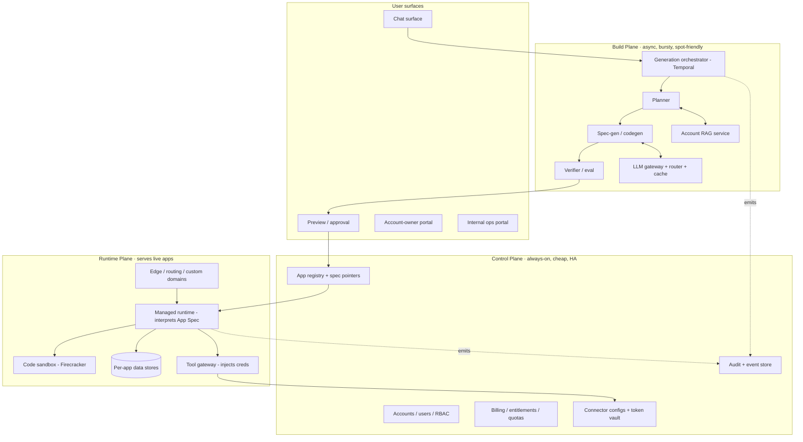
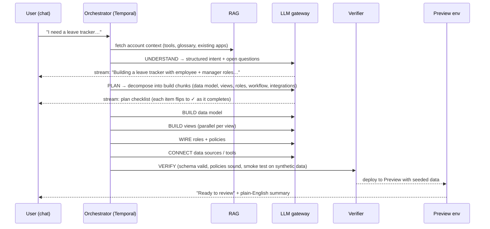
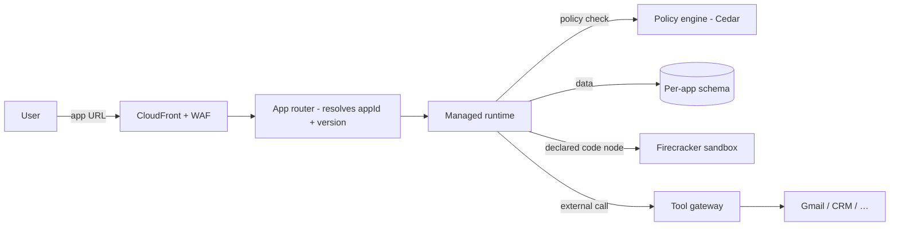
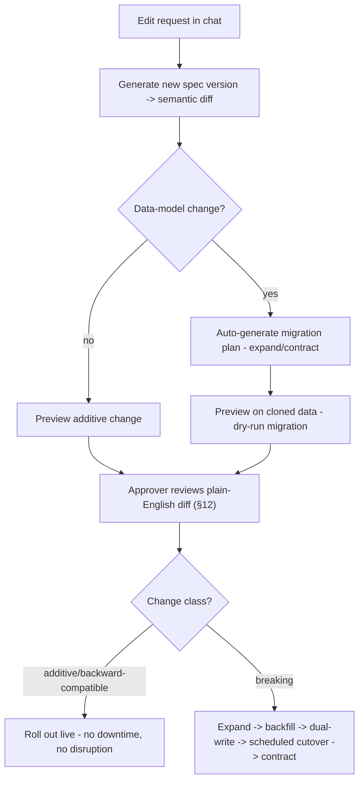

# Ziroo — Platform Architecture

> **What Ziroo is:** an AI colleague for small teams that *builds internal tools from a
> plain-language description*. Someone types "I need a leave tracker where employees submit
> requests, managers approve, and balances decrement automatically," and a few minutes later a
> working app exists at a URL — with its own data model, role-based views, and an approval flow.
> The user never assembles anything: no canvas, no component palette, no drag-and-drop, no
> property panels. They describe; Ziroo builds.
>
> This document is the founder-level architecture: the decisions, the reasoning behind them, the
> alternatives rejected, and how the whole thing scales, stays cheap, and survives the next three
> years. It is written to be *future-proof by design but incremental in rollout* — every hard
> boundary exists from day one, but we only pay for the heavy machinery as demand justifies it.

**Status:** Draft v1 · **Audience:** founder, eng leadership · **Author:** architecture pass
**Confirmed foundational decisions:** Greenfield standalone · Architect for hyperscale, roll out
incrementally · Hybrid app runtime (managed runtime + code escape hatch) · AWS.

---


## Table of contents

1. [First principles & the four hard problems](#1-first-principles--the-four-hard-problems)
2. [Foundational decisions (ADR summary)](#2-foundational-decisions-adr-summary)
3. [The 10,000-ft view: three planes](#3-the-10000-ft-view-three-planes)
4. [The App Spec — the keystone abstraction](#4-the-app-spec--the-keystone-abstraction)
   - [4.1 Metadata-driven vs code-generation](#41-metadata-driven-vs-code-generation--the-fork-under-the-keystone)
   - [4.2 Default widgets vs dynamic widgets](#42-default-widgets-vs-dynamic-widgets)
   - [4.3 When metadata grows — token cost & latency](#43-when-metadata-grows--keeping-token-cost-and-latency-flat)
   - [4.4 When code is unavoidable — reliability, consistency, cost](#44-when-code-is-unavoidable--reliability-consistency-and-cost)
   - [4.5 Formulas — static, dynamic, and the auto-decrement](#45-formulas--static-dynamic-and-how-the-balance-actually-decrements)
5. [Multi-tenancy & isolation](#5-multi-tenancy--isolation)
6. [The generation pipeline (prompt → app)](#6-the-generation-pipeline-prompt--app)
7. [Prompt handling](#7-prompt-handling)
8. [Chunk-level architecture](#8-chunk-level-architecture)
9. [Account-wise RAG with configured tools](#9-account-wise-rag-with-configured-tools)
10. [The generated-app runtime (hybrid model)](#10-the-generated-app-runtime-hybrid-model)
11. [Roles, authentication & authorization](#11-roles-authentication--authorization)
12. [The approval gate](#12-the-approval-gate)
13. [Version control for builds](#13-version-control-for-builds)
14. [The follow-up edit & live data migration](#14-the-follow-up-edit--live-data-migration)
15. [Coherence across generated apps](#15-coherence-across-generated-apps)
16. [Sandbox mode](#16-sandbox-mode)
17. [Connectors & secrets](#17-connectors--secrets)
18. [Workflows, webhooks & scheduling](#18-workflows-webhooks--scheduling)
19. [AI / LLMOps & model cost plan](#19-ai--llmops--model-cost-plan)
20. [Rate limiting & quotas](#20-rate-limiting--quotas)
21. [Data storage & protection](#21-data-storage--protection)
22. [Security & threat model](#22-security--threat-model)
23. [Observability & debugging](#23-observability--debugging)
24. [Cost optimization & FinOps](#24-cost-optimization--finops)
25. [Tech stack](#25-tech-stack)
26. [Deployment, CI/CD & environments](#26-deployment-cicd--environments)
27. [Admin portals — internal & account-owner](#27-admin-portals--internal--account-owner)
28. [Customer & account management](#28-customer--account-management)
29. [Migration strategy](#29-migration-strategy)
30. [Reliability: DR, backups, SLOs](#30-reliability-dr-backups-slos)
31. [Scale roadmap & build order](#31-scale-roadmap--build-order)
32. [Risks & what we chose not to do](#32-risks--what-we-chose-not-to-do)
33. [Appendix: decision log & glossary](#33-appendix-decision-log--glossary)

---


## 1. First principles & the four hard problems

Every decision below is downstream of five tenets:

1. **The App Spec is the product, not the code.** What Ziroo produces is a declarative,
  versioned description of an app — not a pile of generated source. Code is an *implementation
   detail* the runtime may or may not use. This single choice is what makes versioning, coherence,
   migration, cost, and safety tractable at once. (§4)
2. **Describe, don't assemble.** The only authoring surface is conversation. Everything else the
  user touches (preview, approval, admin) is *read-and-decide*, never *build*.
3. **The audience is non-technical.** Ops managers, founders, office managers. No diff, no code,
  no YAML is ever shown to a normal user. Every state — including failure — is explained in plain
   language.
4. **Everything is multi-tenant and role-aware from byte one.** Apps hold real company data.
  "An employee must not see the manager's view" is a *platform* guarantee enforced centrally, not
   something each generated app re-implements.
5. **Future-proof by architecture, incremental by rollout.** We design the seams for 100k+
  accounts and millions of apps now, but we deploy the cheap single-region slice first and grow
   into the machinery. Over-provisioning is a cost bug.

The assignment names four problems that are genuinely hard and where competitors (Replit, Base44,
Zite, Rocket) are weak or silent. They are load-bearing requirements, not features:


| #   | Problem                                                                                  | Where it's solved here                                                 |
| --- | ---------------------------------------------------------------------------------------- | ---------------------------------------------------------------------- |
| A   | **The wait** — generation takes minutes, can partially fail                              | §6 pipeline as a durable, streamed, stage-level workflow               |
| B   | **The approval gate** — a non-engineer must *meaningfully* approve                       | §12 preview env + plain-English semantic diff                          |
| C   | **The follow-up edit** — change an app that already holds live data with people mid-flow | §14 spec-diff → reversible zero-downtime data migration                |
| D   | **Coherence** — many apps must feel like one product                                     | §4 + §15 shared spec schema + one component library + coherence linter |


---


## 2. Foundational decisions (ADR summary)


| ID  | Decision              | Choice                                                           | One-line reason                                                                                                                                                                            |
| --- | --------------------- | ---------------------------------------------------------------- | ------------------------------------------------------------------------------------------------------------------------------------------------------------------------------------------ |
| D1  | Build substrate       | **Greenfield standalone**                                        | Per-app isolation, independent scaling, and an owned release cadence are far cleaner in a purpose-built codebase than retrofitted onto a general-purpose platform; Ziroo owns its full stack end to end.                       |
| D2  | Scale horizon         | **Hyperscale seams, incremental infra**                          | Design tenancy/isolation/metering for 100k+ accounts now; deploy single-region pooled first.                                                                                               |
| D3  | Generated-app runtime | **Hybrid: managed runtime + code escape hatch**                  | 95% of internal tools are CRUD + views + roles + workflows — expressible declaratively (cheap, safe, coherent, versionable). Escape to sandboxed code only when the spec can't express it. |
| D4  | Cloud                 | **AWS**                                                          | Best primitives for the two hardest needs: strong workload isolation (Firecracker/Fargate) and managed data/AI services (Aurora, DynamoDB, Bedrock, Verified Permissions).                 |
| D5  | Core abstraction      | **App Spec (declarative IR)**                                    | Makes versioning, migration, coherence, and cost tractable simultaneously (§4).                                                                                                            |
| D6  | Primary language      | **TypeScript end to end**                                        | One talent pool; spec *types* shared between generator, runtime, and UI; Go reserved for hot-path infra services.                                                                          |
| D7  | Durable orchestration | **Temporal**                                                     | Generation is a minutes-long, resumable, partially-failing workflow — exactly Temporal's job.                                                                                              |
| D8  | Authorization         | **Centralized policy engine (Cedar / AWS Verified Permissions)** | Role isolation is a platform guarantee; policies are declared in the spec and evaluated centrally, never hand-written per app.                                                             |
| D9  | UI vocabulary         | **Default widgets, curated catalog that grows**                  | Coherence + accessibility + cost require a closed, tested widget set the model *configures*; recurring "dynamic" needs graduate into defaults, never per-app bespoke UI (§4.2).            |
| D10 | Computation model     | **Safe formula expressions; escalate to code only when needed**  | Most calculations are declarative formulas (cheap, safe, explainable); the runtime picks derived vs materialized vs snapshot; code is the last rung of the escalation ladder (§4.4–4.5).  |


Rejected at this level:

- **Build on an existing general-purpose platform (D1 alt):** fastest start, but a shard model tuned
for one product's data rarely fits thousands of independent app schemas; the inherited coupling would
leak that platform's release cadence and blast radius into Ziroo. Rejected for long-term isolation.
- **Full-code-per-app (D3 alt, Replit-style):** maximum flexibility, but every app becomes a
deployment, a security boundary, and a cost center; coherence becomes a losing battle. Kept only as
the *escape hatch*, not the default.
- **Fully-managed-declarative-only (D3 alt):** cheapest and safest, but the first genuinely weird
request ("integrate our in-house barcode scanner") becomes impossible. Rejected as too rigid.

---


## 3. The 10,000-ft view: three planes

Ziroo is three planes with hard boundaries. They fail, deploy, and scale independently.




- **Control Plane** — the source of truth for *who* and *what*. Small, transactional, highly
available, cheap. Accounts, users, roles, the app registry (which spec version is live for which
app), billing/entitlements/quotas, connector configs, the token vault, and the audit/event store.
- **Build Plane** — turns a sentence into an App Spec. Async, bursty, expensive per run, idle
between runs → runs on spot/Fargate and scales to zero. Orchestrator (Temporal), planner, spec/
code generator, verifier, the RAG service, and the LLM gateway.
- **Runtime Plane** — serves the live apps to end users. The managed runtime interprets App Specs;
the sandbox runs escape-hatch code; the tool gateway brokers connector calls with server-side
credential injection; the edge handles routing, per-app URLs, custom domains, and WAF.

Why this split: the three planes have *opposite* cost and reliability profiles. The runtime must be
always-on and low-latency; the build plane is bursty and can tolerate seconds of scheduling delay;
the control plane is tiny but must never lie. Collapsing them (as a monolith would) forces the
cheapest component to inherit the most expensive one's SLA.

---


## 4. The App Spec — the keystone abstraction

**Decision (D5):** every generated app compiles to an **App Spec** — a declarative, versioned,
content-addressed document describing the app completely, independent of any runtime. Code, when
generated, is referenced *by* the spec, never the other way around.

An App Spec has these top-level sections:

```jsonc
{
  "specVersion": "1.0",
  "appId": "app_leavetracker",
  "version": "v14",                 // content-addressed; immutable
  "dataModel": {                    // entities, fields, types, relations, constraints
    "LeaveRequest": { "fields": {...}, "relations": {...}, "indexes": [...] }
  },
  "views": [                        // from a CLOSED vocabulary: list, form, detail,
    { "type": "approvalQueue", ... },//  dashboard, approvalQueue, calendar, kanban...
    { "type": "form", ... }
  ],
  "roles": ["employee", "manager"],
  "policies": [                     // Cedar policies: who sees/does what (row + field level)
    "permit(principal in Role::\"employee\", action, resource) when { resource.ownerId == principal.id };"
  ],
  "workflows": [                    // event-driven: on submit -> notify manager -> on approve -> decrement
    { "trigger": "LeaveRequest.created", "steps": [...] }
  ],
  "integrations": [                 // declared connector usage + scopes
    { "connector": "gmail", "scopes": ["send"] }
  ],
  "escapeHatch": [                  // OPTIONAL references to sandboxed code functions
    { "id": "fn_customBalanceCalc", "runtime": "sandbox", "artifact": "s3://..." }
  ],
  "ui": { "theme": "system-default" } // NO per-app styling knobs — coherence by construction
}
```

Why this is the highest-leverage decision in the system — it collapses five hard problems into one:

- **Coherence (Problem D)** is *structural*, not aspirational: every app is drawn from the same
closed vocabulary of view types and rendered by one component library. Two apps can't drift because
there is nothing to drift *with* — no per-app CSS, no free-form layout. (§15)
- **Versioning (§13)** is git-for-specs: a build is a content-addressed spec version. Rollback is a
pointer flip. Diffing two versions is a data-structure diff, not a text diff.
- **Migration (§14)** falls out of spec diffing: a change to `dataModel` mechanically yields a
migration plan.
- **The approval gate (§12)** becomes possible for a non-engineer: a spec diff renders to plain
English ("adds a second approval step for requests over 5 days") because the spec is semantic, not
syntactic.
- **Cost & safety (§10, §19):** interpreting a spec on a shared runtime is far cheaper than running
a server per app, and a closed spec vocabulary has a tiny attack surface compared to arbitrary code.

The **escape hatch** keeps us honest: when a request genuinely can't be expressed declaratively, the
generator emits a code function that runs in the sandbox (§10) and is referenced by a spec node. The
default path stays declarative; the exotic path stays contained.

Spec types are authored once in TypeScript and shared by the generator (produces them), the runtime
(consumes them), and the UI (renders them) — a single schema, no drift between layers.

### 4.1 Metadata-driven vs code-generation — the fork under the keystone

This is the single most consequential engineering decision, and it deserves to be stated head-on. There
are two ways an AI can "generate an app":

- **Metadata-driven (spec/declarative):** the model emits **structured data** — an App Spec — that a
  fixed, human-written, well-tested runtime *interprets*. The model's output is data, validated against a
  schema. (What Ziroo does.)
- **Code-generation:** the model emits **source code** (React components, handlers, SQL) that is compiled
  and run like a normal app. (What Replit / Base44 / v0-style tools do.)

| Dimension | Metadata-driven | Code-generation |
|-----------|-----------------|-----------------|
| Reliability | High — runtime is written once and tested; invalid model output is *rejected by the schema* | Lower — arbitrary code carries bugs, runtime errors, and a fresh security surface per app |
| Coherence (Problem D) | High **by construction** — one renderer, closed vocabulary | Hard — every app is bespoke and drifts |
| Non-engineer approval (Problem B) | Possible — spec is semantic, renders to plain English | Near-impossible — the artifact is a code diff |
| Live edit / migration (Problem C) | Easy — structured spec diff drives the migration | Hard — code diffs are semantically opaque |
| Generation cost | **Low** — compact JSON, cheaper models can fill a schema | **High** — many code tokens, frontier model, more retries |
| Runtime cost | ~0 marginal — one shared interpreter fleet (§10) | Per-app compute / containers |
| Generation latency | Fast — small structured output | Slow — long code emission |
| Safety | Tiny attack surface — no arbitrary code | Large — every app needs a hardware sandbox |
| Debuggability | Deterministic runtime + inspectable spec (§23) | Debugging generated code |

**Decision (D3, restated):** **metadata-driven is the default for ~95% of internal tools; code is a
quarantined escape hatch for the rest.** The reasoning is not "metadata is nicer" — it is that *every
promise Ziroo makes is only reachable through metadata*. Coherence, non-engineer approval, plain-English
edits, near-zero runtime cost, safety, and cheap fast generation **all break** the moment the default
output is code. So code is never the default; it is the exception, and even then it is confined to
*logic, never presentation* (§10.2), so it cannot break coherence.

Rejected — **code-gen as the default** (the obvious, demo-friendly choice): it optimizes for the one
thing (raw flexibility) that internal tools need least, at the cost of the six things they need most.

### 4.2 Default widgets vs dynamic widgets

A "widget" is a UI building block — a view type (table, form, detail, dashboard, approval-queue, calendar,
kanban, chart…). The parallel fork to §4.1, at the UI layer:

- **Default widgets:** a fixed, hand-built, curated catalog. The model **selects and configures** from it.
  Tested, accessible, themed, coherent. Bounded by the catalog.
- **Dynamic widgets:** the model **invents** new widget types on the fly (custom-rendered, usually code).
  Infinitely flexible; breaks coherence, accessibility, and cost.

**Decision:** default widgets are the vocabulary; "dynamic" needs are met by a four-rung ladder that
almost never reaches arbitrary code — because **dynamic must not mean "arbitrary per-app UI."**

1. **Configuration, not invention.** Default widgets are richly parameterized — a `table` supports
   grouping, filters, inline edit, computed columns, conditional formatting, row actions. Most "custom"
   requests are satisfied by *configuring* a default, not inventing a widget.
2. **Composition.** Novel layouts come from *combining* default widgets (a dashboard is tiles of them),
   not new primitives.
3. **Catalog evolution.** When a genuinely new pattern *recurs* (measured by escape-hatch frequency,
   §32), a human adds it to the catalog **once** — tested, themed, accessible — and it becomes a default
   available to *every* app. Dynamic needs become default widgets over time, through a curated pipeline.
4. **True escape hatch (rare).** Only if 1–3 fail: a sandboxed custom widget, visually constrained to the
   design tokens, logic quarantined per §10.2. Instrumented so recurring uses feed rung 3.

This is how Ziroo gets flexibility *and* keeps fifty apps looking like one product (§15): the surface the
model draws from is closed and curated; it grows deliberately, not per-app.

### 4.3 When metadata grows — keeping token cost and latency flat

The sharpest objection to metadata-driven generation: as an account accumulates apps, entities,
connected-tool schemas, glossary, and prior specs, the **context** the model needs seems to grow without
bound → more input tokens → higher cost and latency. If we naively concatenated everything, this would be
fatal at scale. We do not. Prompt size is engineered to scale with **the change**, not **the account**:

- **Retrieve, don't dump (§9).** Context is assembled by *relevance* — only the entities, specs, and
  schemas the current request touches are retrieved (top-k, permission-filtered). Account-level growth
  does not linearly grow the prompt.
- **Slice the spec for edits.** "Add an approval step" needs only the workflow + roles sub-tree, not the
  whole data model and every view. We send the slice, patch it, merge back — so edit-prompt size is flat
  regardless of total app size.
- **Digests before detail (multi-resolution).** A large spec has a compact **digest** (entities, view
  types, key fields). The cheap **planner** works on digests to decide *what* to touch; only the targeted
  generation pulls full detail for that one slice. Planning cost is sub-linear in app size.
- **Emit patches, not rewrites.** The model returns a structured **delta** (JSON-patch-style) to the
  spec, never the whole new spec. Output tokens stay small even for large apps — and the blast radius of
  a bad generation shrinks with it.
- **Prompt caching (§19).** The stable layers — system prompt, design vocabulary, account glossary, the
  app's base spec — are provider-prompt-cached, so multi-turn work doesn't re-pay for them.
- **Budgeted, deterministic assembly (§7).** Every context layer has a token budget; retrieval is capped;
  overflow drops least-relevant. Latency is bounded by construction.

**The decisive structural fact:** the LLM touches metadata **only at build/edit time**. The runtime that
*serves* live apps is **LLM-free** — it interprets the spec with deterministic compute (§10). So metadata
size affects only build-time prompts (handled above) and **never** per-request serving cost or latency.
Growth is a generation-plane concern, bounded by retrieval and slicing — not a runtime tax.

### 4.4 When code is unavoidable — reliability, consistency, and cost

For the escape hatch (§10.2), generated code must be as trustworthy as the metadata path. Three problems,
three answers:

- **Reliability.** Generated code is treated as a **tested, pinned artifact — generated once, not
  re-emitted per run.** It is confined to *pure, typed, single-purpose functions* (compute a value,
  transform data — no UI, no ad-hoc I/O). Before it is allowed to run it must pass the Verify gate (§6):
  type-check, lint, **auto-generated unit tests** (derived from the spec's declared intent + examples),
  execution in the sandbox against synthetic inputs, and a security scan. A declared **input/output
  contract** (from the spec) is enforced at the runtime boundary every call — if the function returns
  garbage, the contract check catches it and the runtime falls back safely.
- **Consistency.** One sandbox runtime, one standard library, one generated-code style, one lint/review
  gate. Every function looks and behaves like every other. No per-app bespoke stacks.
- **Cost.** Code-gen is **amortized** — one expensive build, reused across all future requests — so
  frontier-model code-gen happens rarely. And it sits at the top of an **escalation ladder** climbed only
  when the cheaper rung fails: *default-widget config → composition → **formula/expression** (§4.5) →
  sandboxed code*. Recurring code patterns are promoted down to defaults (§4.2) so future apps never pay
  for them again. Semantic caching reuses prior artifacts for near-duplicate requests.

Net: expensive, less-reliable code is pushed to the last rung, generated once, contract-checked, and
sandboxed — so its cost is amortized and its blast radius contained.

### 4.5 Formulas — static, dynamic, and how the balance actually decrements

Most "calculations" internal tools need — a leave balance, `days = to − from`, `total = qty × price`,
running totals, roll-ups, conditional statuses — are **not code**. Making them first-class is what lets
Ziroo avoid the escape hatch for the common case.

**Formulas are a first-class spec field: a safe expression language, not code.** The generator emits an
expression like `allowance - sum(LeaveRequest where status = approved).days`. Because it is a sandboxed
pure evaluator (no arbitrary code, no I/O), it is reliable, cheap to generate (a short string from a
cheap model), deterministic, and **explainable in plain English** for the approval gate (§12).

The runtime's **formula engine** chooses the evaluation strategy *declaratively, from the spec* — the
static-vs-dynamic decision is made per formula, not globally:

- **Derived (dynamic — evaluated on read):** cheap, row-local computations (`days`, `total`, a status).
  Nothing stored; always fresh. Best when the formula is cheap and the inputs are on the same record.
- **Materialized (static — stored, incrementally maintained):** expensive aggregates and cross-row
  roll-ups (a **leave balance**, a running total). Stored, and kept correct by an **event-driven trigger
  auto-derived from the formula's dependencies** — e.g. *on `LeaveRequest.approved` → decrement balance*.
  This is exactly how "balances decrement automatically" works: it is a materialized formula maintained
  by a workflow (§18) the generator wrote from the formula's dependency graph — no hand-coded trigger.
- **Snapshot (point-in-time static):** values that must be *frozen* (the "balance after this request"
  shown at approval time) are computed once at that event and stored immutably.

Supporting machinery: a **dependency DAG** across formulas means a data change recomputes only the
downstream materialized values (incremental, never a full re-scan), so there are no recompute storms and
no staleness. Materialized updates run **inside the triggering transaction** (or a durable workflow for
cross-entity cases, §18) and are idempotent, so a decrement can never be lost or double-applied. Only when
an expression genuinely cannot express the computation does the engine escalate to sandboxed code (§4.4) —
which must satisfy the same input/output contract. In practice that is rare; formulas cover the long tail
of "calculations" at a fraction of the cost and risk of code.

---


## 5. Multi-tenancy & isolation

**Tenancy model:** *pool by default, silo on demand* (the "bridge" model), chosen per data class.


| Data class         | Default (Phase 0-1)                      | At scale (Phase 2-3)                                  | Isolation mechanism                     |
| ------------------ | ---------------------------------------- | ----------------------------------------------------- | --------------------------------------- |
| Control-plane data | Shared Aurora, `account_id` on every row | Same, read replicas per region                        | Postgres RLS + app-layer scoping        |
| Generated-app data | **Schema-per-app** on shared Aurora      | Hot/large accounts promoted to **dedicated clusters** | Separate schema/DB + connection scoping |
| Vector / RAG       | Namespace-per-account                    | Dedicated collections for large tenants               | Namespace filter enforced server-side   |
| Object storage     | Shared bucket, per-tenant key prefix     | Per-tenant bucket for enterprise                      | IAM prefix scoping + SSE-KMS            |
| Secrets / tokens   | Per-tenant vault entries                 | Per-tenant CMK                                        | KMS envelope encryption                 |


Why pool-then-silo: pooling is 10-100× cheaper at the long tail (most accounts are tiny), while the
*promotion path to silo* — live-migrate a big or sensitive tenant to dedicated infra without a rewrite
(§29) — protects us from the noisy-neighbor and compliance problems that pooling alone can't solve.
Designing the silo seam now (D2) is what makes it a config change later instead of a re-platform.

**Role isolation within an app** (the "employee must not see the manager's view" guarantee) is *not*
left to generated code. Every data access in the runtime passes through the central policy engine
(Cedar / AWS Verified Permissions, D8) evaluating the `policies` declared in the App Spec. The
generator writes policies; the runtime enforces them uniformly; the two never diverge because a view
literally cannot fetch data except through the policy-checked data layer. This is the difference
between a *platform guarantee* and *hoping each generated app got authz right*.

---


## 6. The generation pipeline (prompt → app)

**This section answers Problem A (the wait) and partial failure.**

Generation is a **durable Temporal workflow** (D7), not a request. It is resumable, each step is
independently retriable, and its state is streamed to the UI over SSE/WebSocket. A spinner is never
the answer; the user watches *named stages* complete and can see partial results.




**Stages** (each emits progress + a partial artifact, each can degrade independently):

1. **Understand** — parse intent into a structured brief; surface *clarifying questions* only when a
  choice is load-bearing (defaults otherwise, stated explicitly).
2. **Plan** — decompose into build chunks (§8). The plan is shown as a checklist the user watches.
3. **Build data model** — entities, fields, relations, constraints, indexes.
4. **Build views** — parallelized per view; each is independent.
5. **Wire roles & policies** — generate Cedar policies from the described roles.
6. **Connect data/tools** — bind declared integrations; this is the stage most likely to *partially
  fail* (an OAuth token expired, a scope missing).
7. **Verify** — validate the spec, type-check, run a smoke test against synthetic data, run policy
  soundness checks (e.g., "is there any path for an employee to read another's record?").
8. **Preview** — deploy to a sandbox env with seeded data, ready for approval (§12).

**Partial failure is a first-class state.** Because stages are independent, a run can succeed at
building the UI and roles but fail to connect Gmail. The app still ships to preview, with the Gmail
integration marked **"needs attention"** and a plain-language explanation ("I built everything, but I
couldn't connect your Gmail — the login expired. Reconnect and I'll finish this part."). The user
always knows *exactly what they got*. Contrast with a monolithic generate-or-fail call, which forces
"all or nothing" and hides the boundary.

**Latency budget:** Understand ~2-5s (streamed immediately), Plan ~5-10s, Build 30s-3min depending on
app size, Verify ~10-30s. The UI commits to *showing motion within 500ms* and a concrete stage name
within 2s. Perceived latency is managed by streaming stage transitions and partial artifacts, never by
a progress bar that lies.

---


## 7. Prompt handling

The prompt pipeline is a versioned, testable asset — not strings scattered in code.

- **Prompt registry & versioning.** Every system prompt, planner prompt, and codegen prompt lives in
a registry with a version, an owner, and an eval suite. Prompts ship through the same review + canary
process as code (§19). A regression in generation quality is traceable to a prompt version.
- **Context assembly** (deterministic, layered, and *budgeted*): system prompt → account context
(company profile, connected tools + their schemas, design vocabulary) → retrieved RAG chunks (§9) →
conversation history (summarized beyond a window) → the current request. Each layer has a token
budget; assembly is a pure function so a given input reproduces a given prompt (critical for
debugging, §23).
- **Structured output, always.** The planner and generator are forced to emit schema-validated JSON
(tool-use / structured output), never free text we parse. Invalid output triggers a bounded retry
with the validation error fed back — the model self-corrects instead of us regexing.
- **PII redaction before the model.** A redaction pass strips/【tokenizes】 obvious PII from anything
entering a prompt (§21, §22); the model works on placeholders, re-hydrated server-side after.
- **Prompt-injection defense** (critical — apps touch email, CRM, files, §22): retrieved content and
connected-tool data are wrapped as *untrusted data*, never as instructions. Tool calls that mutate
external systems require the app's *declared* scopes; a model "deciding" to email the whole company
because a retrieved doc told it to is structurally blocked at the tool gateway.

---


## 8. Chunk-level architecture

"Chunk" shows up in three distinct places; all three matter and are designed for explicitly.

**8.1 Build-plan chunking (decompose the app).** The Plan stage breaks an app into independent build
units — data model, each view, roles, each workflow, each integration. Benefits:

- **Parallelism** — independent views build concurrently → lower wall-clock latency.
- **Resumability** — a failed chunk retries alone; the run doesn't restart (Temporal makes each chunk
an activity with its own retry policy).
- **Partial success** — maps directly onto the partial-failure story in §6.
- **Cost control** — small chunks use cheaper models; only planning uses the frontier model (§19).

**8.2 RAG chunking (how account knowledge is indexed).** Company docs, connected-tool schemas, and
existing App Specs are chunked for retrieval (§9): structured sources (schemas, specs) are chunked by
*semantic unit* (one entity, one endpoint) rather than fixed token windows; prose docs use overlapping
windows (~500-800 tokens, ~15% overlap) with section-aware splitting. Each chunk carries metadata
(source, tool, freshness, ACL) so retrieval can filter by permission and recency.

**8.3 Streaming chunking (delivery to the UI).** Two levels: **token streaming** for the conversational
"what I'm building" narration, and **stage/artifact streaming** for the build checklist and previewable
partial results. The transport is SSE for the chat narration and a WebSocket channel (per generation
run) for structured stage events, so a reconnecting client can resync from the last acknowledged stage.

---


## 9. Account-wise RAG with configured tools

Each account has an isolated retrieval corpus — its **namespace** in the vector store — that grounds
generation in *that company's* reality.

**What's indexed per account:**

- **Company profile & glossary** — what the business does, terminology ("PTO" vs "leave"), org units.
- **Connected-tool metadata & schemas** — the shape of the account's Gmail labels, Calendar, CRM
objects/fields, Sheets columns. This is what lets Ziroo generate an app that binds to *their* CRM
fields, not generic ones.
- **Catalog of the account's existing App Specs** — so a new app can reuse entities and match the
patterns of apps the team already has. **This is a core coherence mechanism (§15):** the leave
tracker and the purchase-order tool feel related because the second one *retrieved* the first.
- **Prior conversations & decisions** — durable preferences ("we always route approvals to the
department head").

**Isolation & freshness.** The namespace filter is enforced server-side in the RAG service — a prompt
can never retrieve another tenant's vectors. Freshness is maintained two ways: connector webhooks push
schema/data changes for near-real-time re-embedding, and a scheduled reconciler sweeps for drift.
Retrieval is **permission-aware** — chunks carry ACLs so a build acting for one user can't ground on
data that user couldn't see.

**Storage:** pgvector on Aurora at Phase 0 (one less system to run), promoting to OpenSearch Serverless
(vector) or a dedicated vector DB (Turbopuffer/Pinecone) when corpus size or QPS justifies it — the RAG
service hides which is in use behind one interface (D2 in action).

---


## 10. The generated-app runtime (hybrid model)

**Decision (D3): hybrid.** Two runtimes behind one façade; the App Spec decides which serves each
request.

**10.1 Managed runtime (the default, 95% path).** A multi-tenant service that *interprets* App Specs.
It renders views from the shared component library, executes declarative workflows, and reads/writes the
per-app data store — all through the central policy engine. No app-specific process, no per-app deploy.

- **Cost:** one horizontally-scaled fleet serves thousands of apps; publishing a new app is writing a
spec row, not provisioning infra → **near-zero marginal cost and instant deploy/rollback**. It is
**LLM-free** — no model call per request — so serving cost/latency is independent of spec size (§4.3).
- **Safety:** closed vocabulary → tiny attack surface; no arbitrary code executes here.
- **Coherence:** one renderer → every app looks and behaves like one product (§15).
- **Formula engine:** interprets the spec's declarative formulas, choosing *derived* (on-read),
*materialized* (stored + incrementally maintained via dependency-triggered workflows), or *snapshot*
(frozen at an event) per formula — this is how balances decrement automatically (§4.5).

**10.2 Code sandbox (the escape hatch).** When the spec references a code function (custom calc,
exotic transform, unusual integration), it runs in an isolated **Firecracker microVM** (via Fargate),
**no network egress by default**, all outbound brokered through the tool gateway, CPU/mem/time-bounded,
and destroyed after use. Cold-start hidden by a warm pool.

- **Why microVM, not a shared interpreter:** running tenant-authored code demands a hardware-grade
boundary; a language-level sandbox is not enough when the code is essentially untrusted.

**10.3 Serving path.**




**Per-app URLs & custom domains:** apps are served under `*.ziroo.app/<account>/<app>` by default, with
CNAME-based custom domains for enterprise (ACM-managed TLS). Routing resolves *account → app → live spec
version* from the registry (cached in Redis) on every request, so a version rollback is visible instantly.

---


## 11. Roles, authentication & authorization

- **Platform identity.** Account owners and members authenticate via email magic-link + OAuth (Google/
Microsoft) in Phase 0-1; **SSO (SAML/OIDC) + SCIM** for enterprise (Phase 3). One identity service
issues short-lived JWTs; sessions and refresh handled centrally.
- **End-user identity for generated apps.** App end users (the employees using the leave tracker) are
members of the account; the same identity service issues app-scoped tokens carrying their role(s).
- **Authorization (D8).** Cedar / AWS Verified Permissions is the single decision point. App Specs
declare policies; the runtime asks Cedar "can principal P do action A on resource R?" on every access,
including **row-level** (own records vs all) and **field-level** (a manager sees salary; an employee
doesn't). Policies are versioned with the spec, so authz changes are part of the approvable diff (§12).
- **Why centralized:** authz is the one thing you cannot let an LLM improvise per app. A central engine
gives one place to audit, test, and prove soundness ("no employee-reachable path to another's row").

---


## 12. The approval gate

**This section answers Problem B: a non-engineer must *meaningfully* approve — not rubber-stamp.**

The approver cannot read code or a diff. So we never show one. What they approve is built entirely from
the semantic App Spec:

1. **Plain-English summary of intent.** "This app lets employees submit leave requests. Managers in the
  *Approvals* group can approve or reject. Approved leave decrements the employee's balance
   automatically." Generated from the spec, not the prompt (so it reflects what was *actually* built).
2. **A guided walkthrough on real-shaped data.** The preview env (§16) is seeded with synthetic-but-
  realistic data. The approver clicks through the actual screens as an employee, then as a manager —
   experiencing the app, not reading about it.
3. **Explicit "what this app can touch."** The data it stores, the roles and who's in them, and the
  connected tools + scopes it will use ("can send email as your team; cannot read email").
4. **For edits: a plain-English semantic diff** (§14) — "**Adds** a second approval step for requests
  longer than 5 days. Existing pending requests are unaffected." — never a code diff.

Approval is an explicit, audited action that flips the app (or the new version) from preview to
production. Routing is configurable per account (who can approve what). This turns approval from a
rubber stamp into an informed decision, which is the whole point.

---


## 13. Version control for builds

Builds are **git-for-specs**:

- Every build produces an **immutable, content-addressed App Spec version** stored in S3 with metadata
in the registry. Identical specs dedupe by hash.
- The registry holds pointers: `app → { previewVersion, prodVersion }`. **Promotion** and **rollback**
are pointer flips → instant, no rebuild.
- **History & diffing** are native because specs are structured: any two versions diff to a semantic
changeset that renders to English (feeding §12 and §14).
- **Data vs spec are versioned separately.** A spec version may or may not require a data migration; the
migration is its own versioned, reversible artifact (§14). Rolling back a spec triggers the paired
reverse migration only if the forward one ran.
- **Branching (later):** a "try a change without touching prod" flow is just a second pointer
(`draftVersion`) served in the sandbox — no new machinery.

This is strictly better than versioning generated *source*: text diffs are meaningless to the audience,
and rolling back source risks state/schema skew. Versioning the semantic artifact keeps rollback safe
and explanations honest.

---


## 14. The follow-up edit & live data migration

**This section answers Problem C: change an app that already holds live data with people mid-flow.**

Flow for "Add a second approval step for anything longer than five days," a week into production use:




Key mechanics:

- **Spec diff drives migration.** A change to `dataModel` mechanically yields a migration plan. Ziroo
proposes it; the human approves the *effect* in English, never SQL.
- **Expand/contract (a.k.a. parallel-change) for zero downtime.** Add the new column/table (expand),
backfill, dual-write from both old and new spec versions during a transition window, cut reads over,
then remove the old (contract). People mid-flow are never interrupted because both shapes are valid
during the window.
- **Additive changes go live immediately** (a new optional approval step doesn't break in-flight
requests); **breaking changes are gated** behind preview + a scheduled cutover the approver picks.
- **Reversibility.** Every migration ships with its inverse; a rollback of the spec runs the reverse
migration. Dry-runs execute against a clone of the app's real data in the sandbox so the approver sees
the true effect before anything touches production.

This is the piece no competitor addresses: they let you *re-generate*, but they don't reconcile the new
app with the *live data and in-flight work* of the old one.

---


## 15. Coherence across generated apps

**This section answers Problem D — and names who/what enforces it.**

Coherence is enforced by *construction*, not review. Three mechanisms, each removing a way apps could
drift:

1. **One component library + design tokens.** Every managed-runtime app renders through the same React
  component set and token system. There is no per-app styling knob in the App Spec (§4). Fifty apps
   share one visual and interaction language because they share one renderer.
2. **A closed view vocabulary.** Views come from a fixed catalog (list, form, detail, dashboard,
  approvalQueue, calendar, kanban, …). The generator *selects and configures*; it cannot invent a
   bespoke layout. New patterns are added deliberately to the catalog, reviewed once, then available to
   all apps.
3. **RAG-driven convention reuse (§9).** New apps retrieve the account's existing specs and reuse their
  entities, naming, and role conventions — so an account's apps feel like *that team's* product, not
   just Ziroo's.

**Enforcement owner:** the **App Spec schema + the shared component library + a "coherence linter" in the
Verify stage** (§6). The linter rejects specs that reach outside the vocabulary or duplicate an entity
that should be shared. Coherence is thus a build-time gate, not a human style-police function — which is
the only way it survives at "fifty apps per account" scale.

Escape-hatch code (§10.2) is the one place that could break coherence; it's therefore confined to
*logic*, never presentation — sandboxed functions compute values, they don't render UI.

---


## 16. Sandbox mode

Sandbox is the safe space between "generated" and "in production," and it does triple duty:

- **Preview for approval (§12)** — every new app/version lands here first, seeded with synthetic data.
- **Dry-run for migrations (§14)** — runs against a clone of the app's real data so effects are real but
isolated.
- **Experiment branch (§13)** — a `draftVersion` served only in the sandbox lets a team try a change
without touching prod.

**Data in sandbox:** synthetic generation for brand-new apps (realistic shapes, no real PII); optional
*masked* copies of production data for migration dry-runs (PII tokenized). Sandbox and prod are the same
runtime with a different data binding and a non-indexed URL, so "promotion" is a pointer flip, not a
re-deploy — what you approved is byte-identical to what ships.

---


## 17. Connectors & secrets

- **Connector framework.** Each integration (Gmail, Calendar, CRM, Sheets, Slack, …) is a plugin
implementing a common interface: auth, schema introspection (feeds RAG, §9), and typed actions/
triggers. Adding a connector doesn't touch the core.
- **Token vault.** Per-account OAuth tokens are stored encrypted with **per-tenant KMS keys**, in the
control plane, never in specs or prompts.
- **Tool gateway (the credential firewall).** All external calls from apps/sandboxes route through the
tool gateway, which injects credentials **server-side** and checks the call against the app's *declared*
scopes. The model and the generated app see *capabilities* ("send email"), never secrets. This is both
a security control (§22) and the enforcement point for prompt-injection defense.
- **Schema sync.** Connectors push change webhooks (near-real-time) and are periodically reconciled, so
RAG and generation stay current with the account's actual tool schemas.

---


## 18. Workflows, webhooks & scheduling

Generated apps are not just CRUD — the leave tracker's "on approve, decrement balance, notify employee"
is a workflow. This is a first-class subsystem.

- **Declarative workflows in the spec.** `trigger → conditions → steps`. Triggers: data events
(`LeaveRequest.created`), schedules (cron), inbound webhooks, connector events. Steps: mutate data,
call a connector action, send a notification, run an escape-hatch function, wait/timer.
- **Durable execution.** Long-running or multi-step workflows (approvals with SLA timers, "escalate if
not approved in 2 days") run on **Temporal** so they survive restarts and are exactly-once. This reuses
the same durability substrate as the build plane (D7) — one thing to operate.
- **Inbound webhooks.** Each app can expose signed webhook endpoints (HMAC-verified) to receive events
from external systems; the edge validates signatures before anything reaches the runtime.
- **Outbound webhooks & events.** Apps publish domain events (via EventBridge) that other apps or
external systems subscribe to — this is also how apps in one account compose without bespoke glue.
- **Idempotency & retries.** Every workflow step is idempotent (idempotency keys) with bounded retry +
dead-letter, so webhook storms and connector flakiness don't corrupt state.

---


## 19. AI / LLMOps & model cost plan

AI is the single largest variable cost and the largest quality risk. It gets its own operational spine.

**19.1 Model portfolio & routing.** No single model for everything. An **LLM gateway** routes by task:


| Task                                         | Model tier                         | Why                                            |
| -------------------------------------------- | ---------------------------------- | ---------------------------------------------- |
| Intent classification, routing, simple edits | Small / cheap (e.g., Haiku-class)  | High volume, low difficulty                    |
| Planning, spec/codegen, migration reasoning  | Frontier (e.g., Opus/Sonnet-class) | Hardest reasoning; quality dominates cost here |
| Summaries, narration, redaction              | Mid / cheap                        | Bulk work, quality-tolerant                    |
| Embeddings (RAG)                             | Dedicated embedding model          | Cheap, batched                                 |


Served via **Amazon Bedrock** (multi-model, keeps data in-VPC, one bill) with a **direct-to-provider
fallback** (e.g., Anthropic API) for capacity/model-availability. The gateway abstracts provider so we
can add/swap models without touching callers (D2).

**19.2 Cost controls (in priority order):**

- **Prompt caching** — system prompts and per-account context (large, stable) are cached at the provider
→ the biggest single saving on multi-turn generation.
- **Semantic cache** — near-duplicate generation requests return a cached spec (with confirmation).
- **Right-sized routing** — never send a classification task to the frontier model.
- **Tier by chunk** — small build chunks (§8) use cheaper models; only planning pays frontier prices.
- **Batching** — embeddings and non-interactive jobs use batch APIs.
- **Budget guards** — a generation run has a hard token/cost ceiling; exceeding it degrades gracefully
(simpler plan) rather than silently burning money.

**19.3 Quality & safety:**

- **Eval harness** — a golden set of prompts → expected spec properties, run in CI on every prompt/model
change; canary a % of prod traffic before full rollout.
- **Guardrails** — Bedrock Guardrails + custom checks for PII leakage, unsafe tool use, and
prompt-injection (§7, §22).
- **Verifier stage** (§6) — the model's output is *validated by machines* (schema, type-check, policy
soundness, smoke test), not trusted. This is what makes "AI-generated" safe enough for company data.

**19.4 Metering.** Every LLM call is metered (tokens in/out, model, cost, latency, run, account) into the
event store → feeds billing (§28), quotas (§20), the internal cost dashboard (§27), and the debug trace
viewer (§23).

---


## 20. Rate limiting & quotas

Defense in depth — five layers, because each protects against a different failure:


| Layer          | Protects against                     | Mechanism                                            |
| -------------- | ------------------------------------ | ---------------------------------------------------- |
| Edge           | DDoS, volumetric abuse               | CloudFront + WAF + Shield, per-IP                    |
| API            | Runaway clients, scraping            | Per-account/user token buckets (Redis)               |
| Generation     | Cost blowout, build-queue starvation | Per-account concurrent-build cap + token/cost budget |
| Runtime        | One app hammering shared runtime     | Per-app request rate + concurrency limits            |
| Model provider | Hitting provider TPM/RPM ceilings    | Gateway-side account-fair queueing + backpressure    |


Quotas are **entitlement-driven** (§28): plan tier sets generation volume, app count, runtime QPS, seats,
and storage. Hitting a quota is a *product event* — a clear in-product message and an upgrade path — not
an opaque 429. Fairness across tenants (no noisy neighbor) is enforced by per-account queues in the
build plane and per-app limits in the runtime.

---


## 21. Data storage & protection

**Storage map** (right tool per job; each hidden behind a service interface so it can evolve — D2):


| Store                   | AWS service                                  | Holds                                                        |
| ----------------------- | -------------------------------------------- | ------------------------------------------------------------ |
| Relational control      | Aurora PostgreSQL (Serverless v2)            | Accounts, users, roles, registry, billing, connector configs |
| Relational app data     | Aurora PostgreSQL (schema-per-app)           | Each generated app's records                                 |
| High-write / KV         | DynamoDB                                     | Job state, sessions, event ingest, per-app hot counters      |
| Specs & build artifacts | S3 (content-addressed)                       | Immutable App Spec versions, sandbox code artifacts          |
| Files / uploads         | S3 (per-tenant prefix, SSE-KMS)              | App file fields, exports                                     |
| Vector / RAG            | pgvector → OpenSearch Serverless / vector DB | Per-account embeddings (§9)                                  |
| Event / audit           | DynamoDB / Kinesis → S3 → Athena             | Immutable audit log, usage events, metering                  |
| Cache / queues          | ElastiCache (Redis), SQS, EventBridge        | Sessions, rate limits, routing cache, async work             |
| Durable workflow state  | Temporal (backed by its own store)           | Generation + app workflows                                   |
| Analytics / warehouse   | S3 data lake + Athena/Redshift               | Internal analytics, FinOps, product metrics                  |


**Protection:**

- **Encryption everywhere** — TLS 1.2+ in transit; SSE-KMS at rest; **per-tenant CMKs** for sensitive
classes (tokens, app data for enterprise).
- **PII handling** — detection + tokenization before data enters prompts (§7); classification tags on
fields so policies and retention can treat PII specially.
- **Retention & deletion** — per-account retention policy; **GDPR right-to-erasure via crypto-shredding**
(destroy the tenant CMK → data is unrecoverable) plus hard-delete sweeps.
- **Backups** — Aurora PITR (point-in-time recovery), S3 versioning + cross-region replication for
artifacts (§30). Backups are encrypted and access-audited.
- **Data residency** — region-pinned per account (Phase 3), enabling EU-only storage for accounts that
require it. The tenancy model (§5) makes residency a placement decision, not a rewrite.

---


## 22. Security & threat model

Ziroo is unusually sensitive: it holds real company data, has live credentials to email/CRM/files, and
executes AI-generated logic. The threats and controls:


| Threat                                                    | Control                                                                                                                                                                 |
| --------------------------------------------------------- | ----------------------------------------------------------------------------------------------------------------------------------------------------------------------- |
| **Cross-tenant data access**                              | `account_id` on every row + Postgres RLS + Cedar policy checks + namespace filters; schema/DB isolation for app data; tested by automated tenant-isolation checks in CI |
| **Broken in-app authz** (employee sees manager view)      | Central policy engine (§11), soundness checks in Verify (§6); generated apps *cannot* fetch data outside the policy path                                                |
| **Prompt injection via retrieved data / connected tools** | Untrusted-data framing (§7); tool gateway enforces *declared* scopes; mutating external actions gated + audited; guardrails on inputs/outputs                           |
| **Malicious escape-hatch code**                           | Firecracker microVM, no default egress, brokered network, resource + time caps, ephemeral (§10.2)                                                                       |
| **Credential theft**                                      | Tokens in per-tenant KMS-encrypted vault; injected server-side by tool gateway; never in specs/prompts/logs                                                             |
| **Volumetric / DDoS**                                     | CloudFront + WAF + Shield; rate limits (§20)                                                                                                                            |
| **Supply chain**                                          | Pinned deps, SBOM, signed artifacts, least-privilege IAM per service                                                                                                    |
| **Insider / support access**                              | Support impersonation is consent-gated, time-boxed, and fully audited (§27)                                                                                             |


Posture targets: **SOC 2 Type II** and **GDPR** (Phase 3), with the audit log, encryption, access
controls, and data-residency seams built from the start so certification is evidence-gathering, not
re-architecture. Every plane emits to the **immutable audit log**; security events stream to a SIEM.

---


## 23. Observability & debugging

Three audiences, three lenses — all from OpenTelemetry traces, structured logs, and metrics tagged by
`account / app / build / run`.

- **Platform (SRE) view.** RED/USE metrics per service, distributed traces across planes, error budgets
and SLOs (§30), alerting on golden signals. Standard, but tenant-tagged so we can see one account's
experience.
- **Generation debug view (the "why did this build do that?" tool).** Because prompt assembly is a pure
function (§7) and every LLM/tool call is metered (§19), each generation run has a **replayable trace**:
the exact prompts, retrieved chunks, model, tokens, cost, tool calls, retries, and the resulting spec
diff — surfaced in the internal admin (§27) as an LLM-trace viewer. This is how we debug a bad
generation without guesswork, and it directly serves the "debug" requirement.
- **Generated-app runtime view (for account admins).** App owners see their app's health, request logs,
workflow runs (succeeded/failed/retrying), and integration status — in plain language, no stack traces.

Determinism where it counts: seeds and pinned prompt/model versions make a run reproducible enough to
debug; the trace makes non-determinism *observable* even when it can't be eliminated.

---


## 24. Cost optimization & FinOps

Cost is engineered continuously, per lifecycle stage — not audited after the bill:

- **Generation (biggest lever):** model routing, prompt/semantic caching, per-chunk tiering, budget
guards (§19). Target: frontier-model tokens spent only on planning + hard codegen.
- **Runtime:** the managed runtime's shared-fleet model means marginal cost per app ≈ 0; publishing an
app provisions no infra (§10). This is the structural reason Ziroo can be cheaper than
server-per-app competitors.
- **Compute:** build plane on **Fargate Spot + scale-to-zero** (bursty, interruption-tolerant); runtime
on right-sized always-on with autoscaling; sandbox warm-pool sized to demand.
- **Data:** Aurora Serverless v2 (scales with load), DynamoDB on-demand → provisioned once patterns are
known, S3 lifecycle tiering (Intelligent-Tiering → Glacier for old artifacts/logs).
- **Metering → unit economics.** Every account's true cost (tokens + compute + storage + egress) is
attributed via the event store, so we know **gross margin per account** and can price and quota
accordingly (§20, §28). FinOps dashboards flag accounts whose usage outruns their plan.
- **Guardrails against surprise:** budget alerts, anomaly detection on token spend, and per-account
cost ceilings that degrade gracefully.

Principle: **the architecture, not vigilance, keeps cost down** — shared runtime, spec-not-servers,
caching, and metering are structural. Vigilance (dashboards, alerts) catches the residual.

---


## 25. Tech stack

Concrete choices, each with a one-line reason. (Abstractions hide the specifics so any one can be
swapped — D2.)


| Layer             | Choice                                                                                   | Reason                                                                                                      |
| ----------------- | ---------------------------------------------------------------------------------------- | ----------------------------------------------------------------------------------------------------------- |
| Language          | **TypeScript** everywhere; **Go** for hot-path infra (tool gateway, runtime interpreter) | One talent pool; shared spec *types* across generator/runtime/UI; Go where per-request latency/cost matters |
| Backend services  | **NestJS/Fastify** (Node)                                                                | Mature, typed, fast; good fit for API + orchestration glue                                                  |
| Durable workflows | **Temporal** (TS SDK)                                                                    | Generation + app workflows are long, resumable, exactly-once (D7)                                           |
| Frontend          | **React + TypeScript**                                                                   | Chat surface, portals, and the App-Spec renderer share one component system                                 |
| Design system     | In-house component library + tokens                                                      | Coherence by construction (§15)                                                                             |
| Auth              | Custom identity service + magic-link/OAuth; SAML/OIDC + SCIM later                       | Control over app-scoped tokens and roles                                                                    |
| Authorization     | **Cedar / AWS Verified Permissions**                                                     | Central, testable, provable policy (D8)                                                                     |
| Datastores        | **Aurora PostgreSQL, DynamoDB, S3, ElastiCache**                                         | §21                                                                                                         |
| Vector            | **pgvector → OpenSearch Serverless / vector DB**                                         | Start simple, promote on scale (§9)                                                                         |
| Messaging         | **SQS + EventBridge**                                                                    | Async work + domain events (§18)                                                                            |
| AI                | **Amazon Bedrock** + direct-provider fallback                                            | Multi-model, in-VPC, one bill (§19)                                                                         |
| Compute           | **ECS Fargate (+ Spot)**; **Firecracker** for sandbox                                    | Serverless-ish ops, strong isolation (§10)                                                                  |
| Edge              | **CloudFront + WAF + Shield + Route 53 + ACM**                                           | Routing, TLS, custom domains, DDoS (§10, §22)                                                               |
| Secrets           | **AWS Secrets Manager + KMS** (per-tenant CMK)                                           | §17, §21                                                                                                    |
| IaC               | **Terraform**                                                                            | Portable, mature, reviewable infra                                                                          |
| CI/CD             | **GitHub Actions → CodeDeploy** (blue-green)                                             | §26                                                                                                         |
| Feature flags     | **OpenFeature/LaunchDarkly**                                                             | Safe incremental rollout (D2)                                                                               |
| Observability     | **OpenTelemetry → managed backend** (e.g., Datadog/Grafana)                              | One tracing standard across planes (§23)                                                                    |


---


## 26. Deployment, CI/CD & environments

- **Independent deploys per plane.** Control, build, and runtime ship separately; a build-plane deploy
never risks live apps. Services are containers on Fargate.
- **Generated apps don't "deploy."** Publishing an app is a spec write + pointer flip (§10, §13) — no
infra change, so app releases and rollbacks are instant and can't fail a deploy.
- **Pipeline:** PR → lint/type-check → unit + integration tests → **prompt eval suite** (§19) →
build/sign image → deploy to staging → smoke + canary → **blue-green** to prod (CodeDeploy) with
automatic rollback on health-check/SLO breach.
- **Migrations reviewed in CI.** Both platform schema migrations and generated-app migration templates
go through automated review (safe locking, `lock_timeout`/`statement_timeout`, expand/contract shape)
before merge — mirroring the discipline that large hot tables demand.
- **Environments:** dev → staging → prod, each multi-AZ. Feature flags decouple *deploy* from *release*
so incremental rollout (D2) is a flag flip, not a redeploy.
- **Regions:** single region + multi-AZ first; multi-region active-passive → active-active as residency
and latency demand (§30, §31).

---


## 27. Admin portals — internal & account-owner

**27.1 Internal ops portal (Ziroo team) — "run the platform effectively."**

- **Fleet view** — all accounts: health, usage, plan, cost, anomalies.
- **Generation debug / LLM-trace viewer** (§23) — replay any build's prompts, retrievals, tool calls,
tokens, cost, and spec diff. The primary "why did it do that?" tool.
- **Cost & token dashboards** — per account/model/feature; margin per account (§24).
- **Abuse & content moderation** — flag/limit accounts generating disallowed apps.
- **Feature flags & model-routing config** — turn features/models on per cohort; run canaries.
- **Support impersonation** — consent-gated, time-boxed, fully audited "view as this account."
- **Quota & entitlement overrides**, incident tooling, migration/backfill controls.

**27.2 Account-owner portal — for the customer's admin.**

- **Users & roles** — invite, assign roles, (later) SSO/SCIM.
- **Connected tools** — connect/disconnect, see scopes, re-auth expired tokens (fixes the partial-fail
case in §6).
- **App catalog** — every app, its versions, who can access each, promote sandbox→prod, rollback.
- **Approval routing** — who approves what (§12).
- **Audit log** — who did what, per app.
- **Usage & billing** — consumption vs plan, invoices, upgrade (§28).
- **Data controls** — export, retention, delete (§21).

Both portals are the same React + component system as everything else (coherence again).

---


## 28. Customer & account management

- **Org model:** `Account (org) → Workspaces (optional) → Users → Roles`. Apps belong to an account;
users have platform roles (owner/admin/member) and per-app roles (§11).
- **Onboarding:** create account → set company profile (seeds RAG, §9) → connect first tools → first
app. The company profile is what makes generation *company-aware* from the first prompt.
- **Billing (usage-based):** metered generation (tokens), runtime consumption, seats, and storage, via
**Stripe**; an **entitlements service** gates features and quotas (§20) by plan. Because we meter true
cost (§24), pricing maps to margin.
- **Lifecycle:** trial → active → past-due/suspended (read-only grace) → offboard (export then
crypto-shred, §21). SSO/SCIM automate enterprise user lifecycle (Phase 3).
- **Standalone identity & billing (D1):** Ziroo owns its own identity and billing services. Any
third-party dependency (e.g. Stripe for payments, an IdP for enterprise SSO) is integrated at a clean
API boundary — a dependency, never an inherited coupling.

---


## 29. Migration strategy

Four distinct migration concerns, each with an owner:

1. **Platform schema migrations** — control-plane DDL via expand/contract, online, reviewed in CI (§26),
  with statement/lock timeouts on hot tables.
2. **Generated-app data migrations** (§14) — auto-generated from spec diffs, reversible, zero-downtime,
  dry-run in sandbox, approved in plain English. The novel, product-facing one.
3. **Tenant relocation** — promote a pooled account to a dedicated cluster/region (for size, noisy-
  neighbor, or residency): snapshot → restore to target → dual-write → backfill/verify → cut over →
   decommission source. Live and reversible. The seam that makes D2's "pool then silo" real.
4. **Import / export** — onboarding imports (from Sheets/CSV/other tools) and full account export
  (portability + GDPR). Content-addressed specs make app export trivially portable.

---


## 30. Reliability: DR, backups, SLOs

- **SLO targets (initial):** runtime (serving live apps) 99.9%; control-plane API 99.9%; generation is
best-effort with a p95 completion target, not a hard uptime SLA (it's async and retriable).
- **Blast-radius containment:** plane isolation (§3) + per-tenant isolation (§5) mean a bad app, a
noisy tenant, or a build-plane outage doesn't take down live apps.
- **Backups & PITR:** Aurora point-in-time recovery; S3 versioning + cross-region replication for specs/
artifacts (an app's spec is its DNA — losing it is unacceptable, so it's the most redundantly stored
thing).
- **DR:** RPO ≤ 5 min / RTO ≤ 1 hr for the runtime + control plane at Phase 2; multi-region
active-passive with tested failover at Phase 3.
- **Graceful degradation:** if the build plane or a model provider is down, live apps keep serving
(runtime doesn't depend on build); new generations queue and inform the user honestly.

---


## 31. Scale roadmap & build order

Future-proof seams now (D2); pay for machinery only as demand justifies. Every phase ships value; no
phase requires re-architecture, because the interfaces exist from Phase 0.


| Phase                              | Goal                   | What's live                                                                                                                                                                                           | What's deferred (seam exists)                       |
| ---------------------------------- | ---------------------- | ----------------------------------------------------------------------------------------------------------------------------------------------------------------------------------------------------- | --------------------------------------------------- |
| **0 — Prove the loop**             | Sentence → working app | Chat surface; Temporal generation (managed runtime only); App Spec + registry; pgvector RAG; one Aurora (pooled + schema-per-app); Bedrock direct; preview + approval; account-owner portal (minimal) | Sandbox code path, model router, silo, multi-region |
| **1 — Make it safe & cheap**       | Trust + margin         | Escape-hatch sandbox; model router + prompt/semantic cache; quotas + rate limits; Cedar policy engine; internal ops portal + LLM-trace debugger; metering + FinOps                                    | Multi-AZ HA depth, SSO                              |
| **2 — Make it robust**             | Enterprise-ready ops   | Multi-AZ HA; tenant silo promotion; OpenSearch vector; canary + blue-green maturity; DR RPO/RTO targets; audit/SIEM                                                                                   | Multi-region, residency                             |
| **3 — Make it global & certified** | Scale + compliance     | Multi-region + data residency; dedicated clusters for enterprise; SSO/SAML + SCIM; SOC 2 Type II + GDPR certification                                                                                 | —                                                   |


Build order rationale: prove the *hard, novel* thing first (the generation loop + spec + approval +
edit), because that's the product and the risk. Safety/cost (Phase 1) before robustness (Phase 2)
because margin and trust gate growth. Global/compliance (Phase 3) is demand-driven and additive.

---


## 32. Risks & what we chose not to do

**What we deliberately did *not* do (and why):**

- **No per-app servers / full-code-by-default.** Rejected for cost, coherence, and security; kept only as
the escape hatch (§10). The declarative default is the whole cost and coherence story.
- **No visual builder / canvas — ever.** It's the anti-thesis of the product (§1). We spend the saved
complexity on the *approval* and *edit* surfaces instead.
- **No per-app styling.** Coherence beats per-app flexibility for internal tools; users get consistency,
not a theme editor (§15).
- **No building on an existing general-purpose platform as a base** (D1) — integrate third parties at
clean API boundaries; don't inherit another product's shard model or release cadence.
- **No multi-region on day one** — a real cost with no early payoff; the seam is built, the infra waits
(§31).
- **No fine-tuned bespoke models initially** — routing + caching + RAG on frontier/managed models is
cheaper and faster to iterate; revisit only if unit economics demand it.

**Top open risks:**

1. **Expressiveness of the App Spec.** If the closed vocabulary is too narrow, users hit the escape
  hatch constantly and coherence/cost benefits erode. *Mitigation:* instrument escape-hatch frequency;
   grow the vocabulary deliberately from real demand.
2. **Generation quality & trust.** A wrong app that *looks* right is worse than a failed one.
  *Mitigation:* machine verification (§6), evals (§19), and the human approval gate (§12) as the
   backstop.
3. **Prompt-injection through connected tools** — the highest-severity security risk given real
  credentials. *Mitigation:* scope-gated tool gateway + untrusted-data framing + guardrails (§22).
4. **Live-data migration correctness** (§14) — the hardest engineering problem; a bad migration on real
  company data is catastrophic. *Mitigation:* expand/contract, dry-run on cloned data, reversibility,
   human approval of effects.
5. **Cost runaway** if metering/quotas lag adoption. *Mitigation:* budgets and metering from Phase 1,
  not bolted on later (§24).
6. **Metadata growth inflating prompts** (§4.3) — if context assembly regresses to "dump everything,"
  generation cost/latency grow with the account. *Mitigation:* retrieval + spec-slicing + digests +
  patch-based edits + prompt caching; assert prompt size scales with the *change*, not the account, in CI.
7. **Escape-hatch code cost & reliability** (§4.4) — over-reliance on generated code is expensive and
  fragile. *Mitigation:* the escalation ladder (config → composition → formula → code), generate-once +
  contract-checked + sandboxed artifacts, and promote-recurring-patterns-to-defaults; track code-rung hit rate.
8. **Formula materialization edge cases** (§4.5) — a wrong static/dynamic choice or a missed dependency
  causes stale or storming recomputes. *Mitigation:* dependency-DAG-driven incremental updates inside the
  triggering transaction, idempotent maintenance, and dry-run verification of derived values in preview.

**Questions worth resolving next** (deliberately left open here): exact plan/pricing tiers and their
quota shapes; which connectors ship in Phase 0; whether to buy or build enterprise SSO/IdP; the initial
closed view vocabulary; and the concrete SLO/error-budget numbers per service.

---


## 33. Appendix: decision log & glossary

**Decision log (ADR index):** D1 greenfield · D2 hyperscale-seams/incremental-infra · D3 hybrid runtime
· D4 AWS · D5 App Spec IR · D6 TypeScript+Go · D7 Temporal · D8 Cedar authz. (See §2 for reasoning and
rejected alternatives.)

**Glossary:**

- **App Spec** — the declarative, versioned, content-addressed description of a generated app; the
system's keystone artifact (§4).
- **Managed runtime** — the shared multi-tenant service that interprets App Specs to serve apps (§10.1).
- **Escape hatch** — sandboxed generated code, referenced by a spec node, for logic the spec can't
express (§10.2).
- **Control / Build / Runtime plane** — the three independently-scaled halves of the system (§3).
- **Coherence linter** — the Verify-stage gate that keeps generated apps within the shared vocabulary
(§15).
- **Expand/contract** — the zero-downtime schema-change technique underpinning live edits (§14).
- **Tool gateway** — the credential firewall through which all external calls pass (§17).
- **Pool / silo** — shared vs dedicated tenant infrastructure; Ziroo pools by default and silos on
demand (§5).

---

*End of v1. This is a living document — each section is a seam meant to be deepened into its own spec
(via the normal spec → plan → implementation cycle) as it's built.*