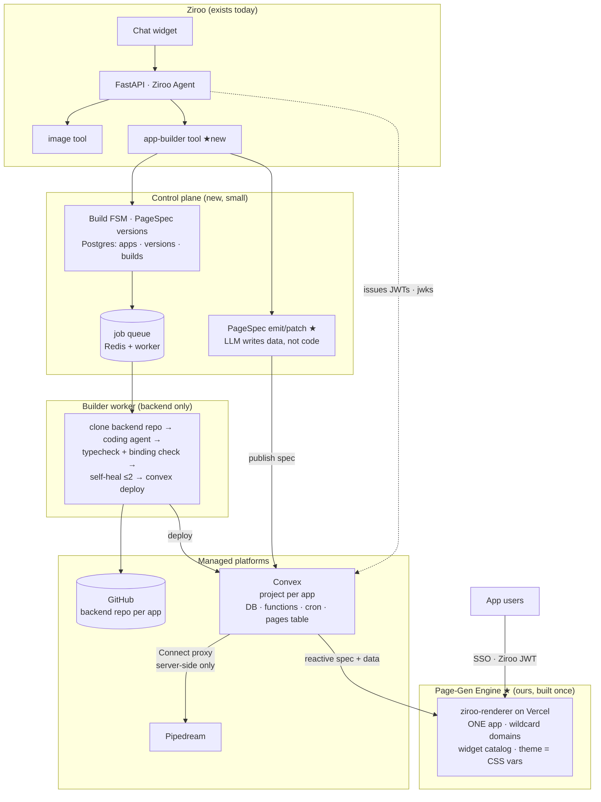
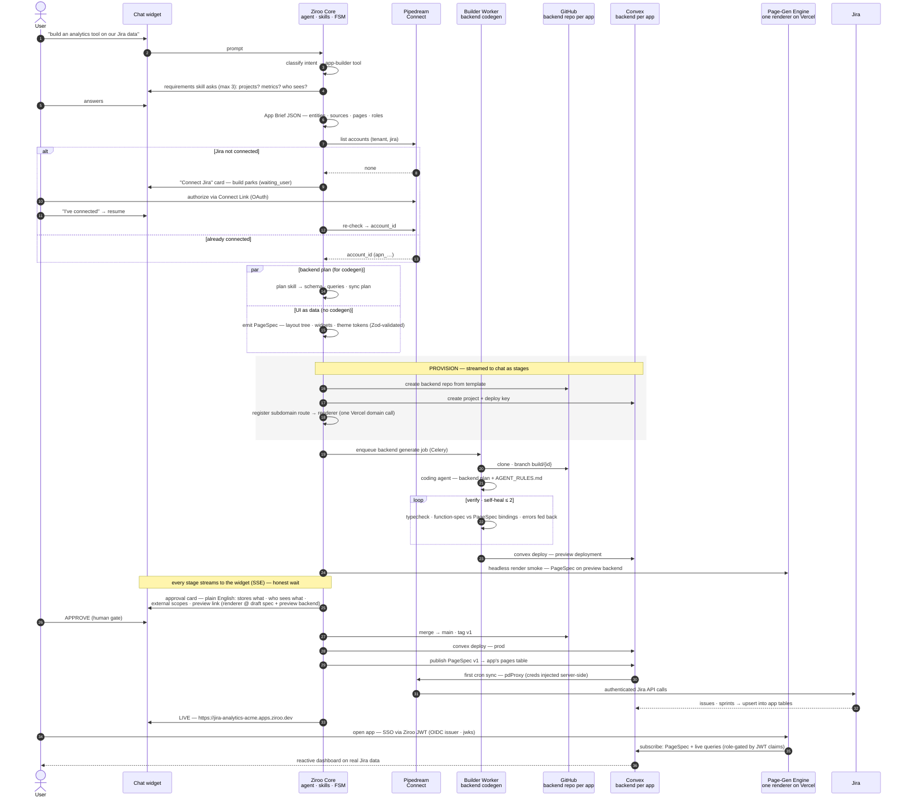
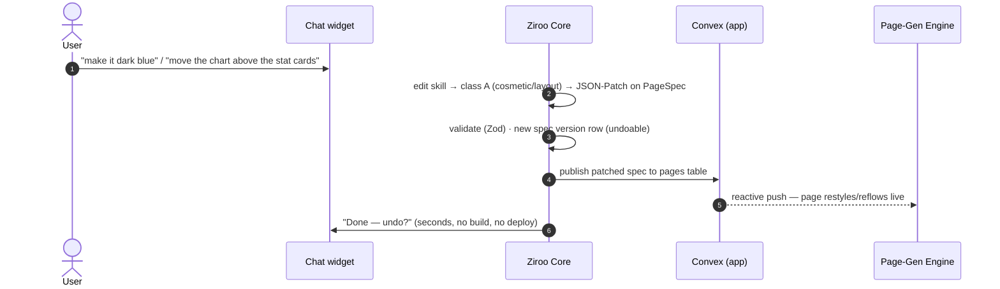

# Ziroo MVP — App Builder on Convex + Page-Gen Engine (Hybrid Path)

> **Scope of this document.** The pragmatic MVP: an `app-builder` tool inside the existing
> Ziroo agent (Python + FastAPI) that generates, deploys, versions, and edits real apps using
> **Convex** (generated backend per app), a **Page-Gen Engine** (ONE renderer app, built once
> with **Next.js + shadcn**, hosted on **Vercel**, that interprets a per-app **PageSpec**),
> **Pipedream Connect** (connectors), and **GitHub** (backend code + versions).
>
> **The core split — where code is generated and where it is not:**
> - **Frontend: NO code generation.** The AI emits and patches a **PageSpec** (layout tree +
>   widget configs + theme tokens). The Page-Gen Engine renders it. Theme change = token patch.
>   "Move this block above that one" = layout patch. Seconds, reversible, no build.
> - **Backend: code generation.** A coding agent writes real Convex code (schema, queries,
>   actions, cron sync) per app, inside template rails, verified before deploy.
>
> This makes the MVP the north-star architecture (`ziroo-architecture.md`) **already realized
> for the UI layer**, with codegen confined to the one place it earns its keep. Section 12
> explains the convergence.

---

## 0 · Verdict

**Buildable with the named stack — and cheaper than a full-codegen MVP, because the frontend
collapses into one artifact we build once:**

| Hard piece | Who solves it | Proof |
|---|---|---|
| Frontend per app, edits in seconds, one coherent look | **Our Page-Gen Engine** — one Next.js + shadcn renderer interprets PageSpec; shadcn theming is CSS variables, so themes are data ([shadcn theming](https://ui.shadcn.com/docs/theming)) | built once in Phase 0 |
| Provision a backend per app, programmatically | **Convex Management API** — create projects/deployments, deploy keys, env vars; built for "AI app builders (Bloom, A0, Macaly)" | [Management API](https://docs.convex.dev/management-api), [Platform APIs](https://docs.convex.dev/platform-apis/overview) |
| Make an LLM reliably generate a Convex backend | **Chef is open source (Apache-2)** — steal its published system prompts + Convex codegen rules | [get-convex/chef](https://github.com/get-convex/chef), [Chef OSS](https://news.convex.dev/open-kitchen-chef-is-now-oss/) |
| Per-tenant OAuth to Jira/Slack/2000+ apps, no token custody | **Pipedream Connect + API proxy** — `external_user_id` + `account_id`, proxy injects credentials | [Connect proxy](https://pipedream.com/docs/connect/api-proxy) |
| Host the renderer + all app subdomains, with rollback | **Vercel** — ONE project, wildcard `*.apps.ziroo.dev`, domains API, Instant Rollback for the renderer itself | [Vercel domains](https://vercel.com/docs/domains/working-with-domains), [Instant Rollback](https://vercel.com/docs/instant-rollback) |
| One login across all generated apps | **Convex custom JWT / OIDC** — Ziroo is the identity provider | [Custom JWT](https://docs.convex.dev/auth/advanced/custom-jwt) |
| Headless coding agent for backend codegen | **Claude Agent SDK** (primary) or **Codebuff SDK / freebuff** (Apache-2) as hedge | [CodebuffAI/freebuff](https://github.com/CodebuffAI/freebuff) |

Engineering surface: **the Page-Gen Engine + widget catalog**, **the PageSpec schema**, **the
orchestrator FSM**, **the backend template + prompt pack**, and **glue to three APIs**
(GitHub · Convex · Pipedream; Vercel only hosts the renderer).

---

## 1 · What already exists vs what gets built

**Exists:** Ziroo chat widget → FastAPI agent server → tool dispatch (image gen, docs/ppt/pdf gen) → Pipedream for connectors → tenant auth/session.

**To build (complete list):**

1. **Page-Gen Engine** (`ziroo-renderer`) — ONE Next.js + shadcn app: subdomain router →
   loads the app's PageSpec + Convex URL → walks the layout tree → renders widgets from a
   **closed catalog**; theme tokens → CSS variables. Built once, owned like a product.
2. **PageSpec schema** (Zod + JSON Schema) — layout nodes, widget configs, theme tokens,
   nav, role visibility. The AI's output format for everything UI.
3. `app-builder` tool + stage skills (requirements, connections, plan **+ pagespec**, generate,
   verify, explain, edit **with edit-class routing**) — prompts + FSM in the existing agent.
4. **Control-plane tables**: `apps`, `app_versions` (backend tag + spec version), `builds`,
   `build_events`, `app_connections`.
5. **Provisioner module**: GitHub repo (backend), Convex project + deploy key, renderer
   subdomain registration. ~3 thin API clients (+1 Vercel call per app: attach subdomain).
6. **Builder worker**: container that runs **backend** codegen jobs only: clone → coding agent →
   verify → deploy. (No frontend builds ever.)
7. **Backend template repo** (`ziroo-backend-template`): Convex project skeleton — auth
   pre-wired to Ziroo JWT, `pdProxy` helper, `AGENT_RULES.md`, verify scripts.
8. **Ziroo OIDC issuer**: JWT signing + jwks endpoints on FastAPI.
9. Chat UX: streamed stages, connect-pause card, approval card, **instant-edit confirmations
   with undo**, app catalog, version history.

**Explicitly NOT built:** per-app frontend repos/projects/deploys · frontend codegen ·
own OAuth vault · own runtime hosting · migration engine (additive-only rule) · billing ·
RAG · custom domains · multi-region.

---

## 2 · One-page architecture



**Trust boundaries:** generated backend code runs only inside Convex; the renderer runs only
*our* code — app-specific behavior enters it exclusively as **validated data** (PageSpec).
Pipedream credentials never leave the server side. The builder container compiles/tests
untrusted-ish generated code in isolation.

### 2.1 · Complete flow — chat to live app (numbered)

Rendered version with commentary: [`ziroo-mvp-flow.html`](./ziroo-mvp-flow.html).



**And the edit fast path — why this architecture wins:**



---

## 3 · The app-builder tool: stages and skills

Same FSM spine; the generate/verify stages now cover **backend code + UI data** in parallel.

```
RECEIVED → BRIEF → CONNECTIONS → PROVISION → GENERATE → VERIFY → PREVIEW → APPROVAL → DEPLOY → LIVE
                 ↘ WAITING_USER (connect link / clarification) — resumable
   any stage ↘ NEEDS_ATTENTION (partial failure: ship what works, retry the rest)
UI-only edits (class A/B) bypass the heavy stages: PATCH → VALIDATE → (PREVIEW?) → APPLY
```

| Stage / skill | What it does | Output |
|---|---|---|
| `requirements` | Elicit purpose, entities, sources, metrics, pages, roles. ≤3 questions. | **App Brief** (JSON) |
| `connections` | Pipedream accounts check; Connect Link pause/resume. | `{provider → account_id}` |
| `plan` | Brief → **backend plan** (schema, query names + arg/return shapes, sync crons) **and PageSpec** (layout, widgets bound to those query names, theme). The query-name contract between the two halves is explicit. | plan.json + pagespec.json |
| `provision` | GitHub backend repo · Convex project + key · subdomain → renderer routing row + Vercel domain attach | skeleton backend + routable URL |
| `generate` | Builder worker: coding agent implements backend plan in template rails | commits on branch |
| `verify` | `tsc` on convex code · **binding check**: every PageSpec query binding exists in `npx convex function-spec` output **[confirm at doc]** · deploy to Convex preview · **headless renderer smoke** (render every page of the spec against preview backend; console clean) · self-heal ≤2 | green or needs_attention |
| `explain` | Plain-English approval card from Brief + plan + spec. Never code. | card + preview link |
| `deploy` | Merge, tag v1, Convex prod deploy, **publish spec to app's `pages` table**, first sync | live URL |
| `edit` | Classify edit (A/B/C, §7) → spec patch fast path or full pipeline | new version |

---

## 4 · Component decisions (options → pick)

### 4.1 The frontend fork — page-gen engine vs per-app codegen (the correction)

| | **Page-Gen Engine (chosen)** | Per-app Next.js codegen (rejected) |
|---|---|---|
| Edit "move block / change theme" | JSON patch, live in seconds, undoable | agent run + build + deploy, minutes, $ |
| Coherence across 50 apps | by construction — one renderer, one catalog | lint + prompts + hope |
| Marginal cost per app (UI) | ~0 — a spec row | Vercel project + builds + storage |
| Failure surface | spec validation (deterministic) | codegen + build + bundle (probabilistic) |
| Arbitrary custom UI | bounded by catalog (escape hatch: grow catalog; later custom-widget slot) | unbounded |
| Engineering to first demo | build renderer once (~1–2 wks) | template + prompts, then per-app flakiness forever |

The catalog-bound tradeoff is the right one for **internal tools** — they're made of tables,
charts, forms, and approvals. When a new pattern recurs, we add a widget **once** and every
app can use it (north-star D9 verbatim).

### 4.2 PageSpec — the UI as data

Zod-validated; stored as versioned rows; published to the app's Convex `pages` table so the
renderer **subscribes** to it (edits appear live). Shape:

```jsonc
{
  "specVersion": 1,
  "app": "jira-analytics",
  "theme": {                            // ← "AI updates the CSS" = patches these tokens
    "mode": "system",
    "primary": "#0F172A", "accent": "#2563EB",
    "radius": "md", "density": "comfortable",
    "font": "inter", "chartPalette": ["#2563EB", "#0EA5E9", "#64748B"]
  },
  "nav": [{ "label": "Dashboard", "page": "dashboard", "icon": "chart" }],
  "pages": [{
    "id": "dashboard", "route": "/", "title": "Dashboard",
    "visibleTo": ["viewer", "lead"],
    "layout": { "type": "stack", "children": [
      { "type": "grid", "cols": 3, "children": [
        { "type": "widget", "id": "w_open",  "widget": "stat-card",
          "config": { "label": "Open issues", "query": "issues.countOpen" } },
        { "type": "widget", "id": "w_cycle", "widget": "stat-card",
          "config": { "label": "Cycle time p50", "query": "issues.cycleP50", "format": "days" } }
      ]},
      { "type": "widget", "id": "w_trend", "widget": "chart",
        "config": { "kind": "line", "query": "issues.throughputWeekly", "x": "week", "y": "count" } }
    ]}
  }]
}
```

- **Layout nodes:** `stack` · `grid` · `split` · `tabs` · `widget`. Every node has a stable `id`
  → the AI edits by id with **JSON-Patch** ("move w_trend before the grid" = one move op).
- **Widget catalog v1 (closed):**

| widget | shadcn base | config essentials |
|---|---|---|
| `stat-card` | Card | label, query, args, format, delta |
| `chart` | shadcn charts (Recharts) | kind: line/bar/area/pie, query, x, y, series |
| `data-table` | Table + TanStack | query, columns[], rowActions (bound to mutations), filters, pageSize |
| `form` | Form + zod | mutation, fields[] (typed from entity), submitLabel |
| `detail` | Description list | query, fields[] |
| `filter-bar` | Select/DatePicker | filters[] feeding page-level query args |
| `text` | Typography | markdown |

- **Theme = shadcn CSS variables.** Renderer maps tokens → `--primary`, `--radius`, etc.
  ([shadcn theming](https://ui.shadcn.com/docs/theming)). Theme edits are data edits — literally
  the user's "AI will update the CSS," done safely through tokens rather than raw stylesheets.
- **Contract with backend:** every `query`/`mutation` string must exist in the generated Convex
  API — checked mechanically at verify time. The plan skill emits both halves from one Brief so
  they can't drift.

### 4.3 The Page-Gen Engine (`ziroo-renderer`) — built once, owned like a product

- ONE Next.js app on ONE Vercel project. Middleware reads the subdomain →
  control-plane registry (cached) → `{convexUrl, appId}` → `ConvexProvider` →
  `<PageRenderer/>` walks the layout tree; widget registry maps `widget` → shadcn component.
- Spec loaded **from the app's own Convex** via `useQuery` → reactive: publishing a patch
  restyles/reflows every open session live.
- Auth: Ziroo JWT (SSO) → Convex validates → widgets receive role-gated data only; renderer
  additionally hides nodes per `visibleTo` (defense in depth — the data gate is Convex).
- Renderer deploys like normal software (its own CI, preview, Instant Rollback) — **platform
  upgrades reach every app instantly**, the coherence dividend.
- Per-app frontend cost: a Vercel **domain attach** call. No project, no build, no bundle.

### 4.4 Backend — Convex, project-per-app, code-generated (unchanged in role, smaller in scope)

- Provisioned via [Management API](https://docs.convex.dev/management-api); deploy keys encrypted
  in the control plane; env vars via CLI in the worker.
- The coding agent now writes **only**: `convex/schema.ts`, queries/mutations with the
  plan-declared names, actions + cron for sync via `pdProxy`, seed function. Smaller domain →
  higher first-pass green rate than full-stack codegen.
- **Analytics pattern: sync, don't proxy-per-request** — cron pages Jira through the proxy into
  local tables; dashboards are live queries. Proxy 30 s timeout never on the read path.
- The app's Convex also holds the published `pages` table (spec) — one subscription surface for
  data + UI.

### 4.5 Code store & versioning — GitHub for backend, spec rows for UI

- GitHub org `ziroo-apps`, **backend repo per app** from `ziroo-backend-template`; `main` = prod,
  `build/{id}` branches, tag per version. GitHub App tokens (repo-scoped).
- An **app version** = (backend git tag, PageSpec version) pair in `ab_app_versions`.
- UI rollback = repoint spec version + republish (instant). Backend rollback = redeploy old tag.
  Cosmetic edits create lightweight version rows too — **everything is undoable**.

### 4.6 Connectors — Pipedream Connect (unchanged)

`external_user_id = tenant_id`; Connect Link pause/resume in chat; generated backends call the
[Connect proxy](https://pipedream.com/docs/connect/api-proxy) only from Convex actions; PD client
creds only in Convex env vars. Central gateway = later, signature-compatible.

### 4.7 Identity — Ziroo is the IdP (unchanged)

FastAPI issues RS256 JWTs (`sub`, `tenant_id`, `email`, `roles`) + jwks endpoints; backend
template's `auth.config.ts` points at Ziroo ([custom JWT](https://docs.convex.dev/auth/advanced/custom-jwt)).
One SSO story for every app, zero per-app auth work.

### 4.8 Orchestration — FSM in Postgres + Celery/Redis (unchanged)

Same stage machine, events table → SSE → widget. UI-only edits skip the queue entirely — they
run inline in the API process (validate + publish ≪ 1 s).

---

## 5 · Control-plane data model (MVP)

```sql
apps            (id, tenant_id, name, slug, status,
                 repo_full_name, convex_project_id, convex_deploy_key_enc, convex_url,
                 prod_url, current_version_id, brief_json, created_by, timestamps)
                 -- no vercel_project_id: the renderer is one shared project; slug routes it

app_versions    (id, app_id, semver, kind,               -- full | ui_patch
                 git_tag, git_sha,                        -- null for ui_patch
                 page_spec_json,                          -- ALWAYS present — spec is versioned data
                 brief_json, plan_json, changelog_md, status,
                 approved_by, timestamps)

builds          (id, app_id, kind,                        -- create | edit | ui_edit | rollback
                 stage, state, branch, prompt_text, error_ctx, token_cost_usd, timestamps)

build_events    (id, build_id, ts, stage, level, message_md)

app_connections (id, tenant_id, app_id, pd_app_slug, pd_account_id, scopes, status)

app_routes      (subdomain PRIMARY KEY, app_id, convex_url)   -- renderer's lookup table (cached)
```

---

## 6 · End-to-end walkthrough — "analytics on our Jira data"

1. **Chat:** user types it → `app-builder`.
2. **BRIEF:** ≤3 sharp questions → App Brief JSON.
3. **CONNECTIONS:** Pipedream check → Connect card → authorize → resume.
4. **PLAN (one LLM pass, two artifacts):** backend plan (tables `jira_issues`, `jira_sprints`;
   queries `issues.countOpen`, `issues.throughputWeekly`, `issues.cycleP50`; cron `sync.jira`
   every 15 min) **and** the PageSpec binding widgets to exactly those names.
5. **PROVISION (~20 s):** backend repo · Convex project · `app_routes` row +
   `jira-analytics-acme.apps.ziroo.dev` attached to the renderer.
6. **GENERATE (1–3 min):** worker: coding agent writes the Convex backend in template rails.
7. **VERIFY:** tsc · **binding check** (function-spec ⊇ spec bindings) · preview deploy ·
   headless render smoke of every page · self-heal ≤2. Sync cron unverifiable? Ship flagged
   `needs_attention` — partial failure is a state, not an apology.
8. **PREVIEW + APPROVAL:** card — *"stores Jira issues in its own database (read-only Jira
   scope, syncs every 15 min); dashboards visible to Analytics role. → Try the preview"*
   (renderer @ draft spec on preview backend). Approve.
9. **DEPLOY:** merge · tag v1 · Convex prod · **publish spec** · first sync →
   **"Live at `https://jira-analytics-acme.apps.ziroo.dev`"**. Single-digit minutes total.

---

## 7 · Edits, versions, rollback — the three-lane model

The edit skill classifies every request; the lane determines ceremony:

| Class | Examples | Path | Latency | Approval |
|---|---|---|---|---|
| **A — cosmetic** | theme/colors, copy, move/resize blocks, reorder nav | JSON-Patch spec → validate → publish | **seconds** | none — confirm + **undo** in chat (audited, versioned) |
| **B — structural UI** | add/remove a widget **bound to existing queries**, new page from existing data | patch → validate → binding check → optional preview | seconds–minute | lightweight confirm |
| **C — backend** | new entity/field, new metric needing a query, new data source, **role/access changes** | full pipeline: codegen → verify → preview → **approval card** | minutes | full human gate |

- Access changes are always class C **even when the diff is one line** — permission is what the
  approval gate exists for.
- Class C still patches the spec (new widgets bound to new queries) — one Brief-rooted change
  produces both halves; the binding check keeps them honest.
- **Rollback:** UI = repoint spec version + republish (instant). Backend = redeploy old tag.
  Data stays safe under the **additive-only schema rule** (adds allowed; rename/retype/delete
  refused; real restructures = expand → backfill → flip reads), mechanically enforced at verify.
- Token economics got better: class A/B edits are ~1–3k tokens (patch on a digest), no engine
  run at all. Only class C pays codegen prices.

---

## 8 · Security & tenancy checklist (MVP-grade)

- Renderer executes **only our code**; per-app behavior arrives as validated data. No generated
  JS ever ships to browsers — the injection surface of "AI-built UI" mostly disappears.
- Spec is sanitized at validation: markdown rendered safely (no raw HTML), URLs allow-listed,
  bindings must resolve — a hostile spec can't script the renderer.
- Generated backend code executes only in Convex; builder container isolated, per-app-scoped
  tokens, workdir destroyed.
- Pipedream tokens stay in Pipedream; Convex actions call the proxy server-side; PD creds only
  in Convex env vars.
- Tenant isolation physical-by-construction (own Convex project/DB per app) + JWT `tenant_id`
  checked in every function + renderer routes only via `app_routes`.
- Spend safety: per-build token budget, per-tenant quotas, kill-switch on the queue.

---

## 9 · Build order (aggressive but real)

| Milestone | Contents | Effort (1–2 engineers) |
|---|---|---|
| **M0 — walking skeleton** | **Page-Gen Engine + widget catalog + PageSpec schema** · backend template · provisioner · worker (backend codegen) · CLI: hardcoded brief → spec emit + backend gen → **live URL** | ~2 weeks |
| **M1 — through the product** | app-builder tool + skills (plan emits both halves) · FSM/queue/SSE · OIDC issuer · Pipedream pause/resume · approval card → **Jira demo from chat** | ~2–3 weeks |
| **M2 — versions & edits** | edit classifier + class-A/B fast lanes with undo · class-C pipeline · previews · English diff · rollback · catalog UI | ~1.5–2 weeks |
| **M3 — hardening** | binding + schema + secret gates · budgets/quotas · eval harness (backend green rate + spec-valid rate) · ops page · security pass | ~1–2 weeks |

**~6–8 weeks.** M0 proves both bets at once: backend codegen reliability AND that the catalog
can express real internal tools.

---

## 10 · Deliberately NOT building (YAGNI shield)

Frontend codegen · per-app Vercel projects/builds · own OAuth vault (Pipedream) · own hosting
(Convex/Vercel) · own agent loop (Agent SDK) · migration engine (additive-only rule) · custom
widgets-as-code slot (catalog grows curated instead) · billing metering · RAG · custom domains ·
multi-region · sandbox infra (preview deployments + draft specs are the sandbox).

---

## 11 · Costs, limits, risks

**Unit economics:** backend codegen ≈ 100–300k tokens/create (≈ $1–3); class-A/B edits ≈
1–3k tokens (~$0.01); class-C edits ≈ 30–150k. Renderer serves all apps from one project —
frontend marginal cost ≈ 0. Idle apps cost ~nothing (usage-metered platforms).

**Plan-limit risk:** Convex project caps per team exist — the Platform APIs exist for exactly
this; talk platform/OEM tiers pre-GA. Vercel is now a single project — that risk is gone.

**Top risks:**

| Risk | Mitigation |
|---|---|
| **Catalog too narrow** (the new #1) | v1 covers tables/charts/forms/detail/filters — the internal-tool 90%; instrument "couldn't express" events; grow catalog from real demand (each addition benefits every app) |
| Backend codegen reliability | template rails + Chef-derived prompts + binding check + self-heal + M0 5-run gate + nightly evals |
| Spec/backend drift | one plan pass emits both; mechanical binding check at verify; publish is atomic per version |
| Renderer = single point of failure | it's a stateless Next.js app: canary deploys, Instant Rollback, and spec `specVersion` gating for breaking renderer changes |
| Destructive schema edits vs live data | additive-only rule enforced at verify; expand/contract for real changes |
| Pipedream proxy 30 s timeout | sync-into-Convex pattern; never proxy on the read path |
| Free-tier coding agents training on data | SDK + own keys only |

---

## 12 · The bridge to the north-star (now half-crossed)

The north-star doc rejected codegen-per-app and bet on spec interpretation. **This MVP now ships
that bet for the entire UI**: PageSpec *is* the App Spec's view/theme/nav subtree; the Page-Gen
Engine *is* the shared renderer; the widget catalog *is* D9; class-A live edits *are* the
"plain-English follow-up" promise, delivered in seconds.

What remains code-generated is the backend — and even there, the **query-name contract** in the
plan is a proto-spec. The convergence path: (1) today — spec UI + generated backend;
(2) next — lift recurring backend shapes (CRUD, sync, aggregations) into declarative spec
sections interpreted by a shared backend runtime, shrinking what the agent writes;
(3) eventually — code only as the audited escape hatch. Every App Brief + PageSpec we store is
input to that migration, not throwaway.

**One-line pitch:** *"The AI never ships code to your browser — it ships a description. Our
page engine renders it, which is why an edit is a sentence and a restyle takes seconds. Code
generation is reserved for the one place it pays: your app's private backend."*

---

## Sources

[Convex Management API](https://docs.convex.dev/management-api) · [Convex Platform APIs](https://docs.convex.dev/platform-apis/overview) · [Convex preview/multiple deployments](https://docs.convex.dev/production/multiple-deployments) · [Convex custom JWT](https://docs.convex.dev/auth/advanced/custom-jwt) · [Chef (OSS)](https://github.com/get-convex/chef) · [Chef prompts/releases](https://github.com/get-convex/chef/releases) · [Pipedream Connect proxy](https://pipedream.com/docs/connect/api-proxy) · [Pipedream Connect API](https://pipedream.com/docs/connect/api-ref) · [shadcn theming (CSS variables)](https://ui.shadcn.com/docs/theming) · [Vercel domains](https://vercel.com/docs/domains/working-with-domains) · [Vercel Instant Rollback](https://vercel.com/docs/instant-rollback) · [CodebuffAI/freebuff](https://github.com/CodebuffAI/freebuff)
