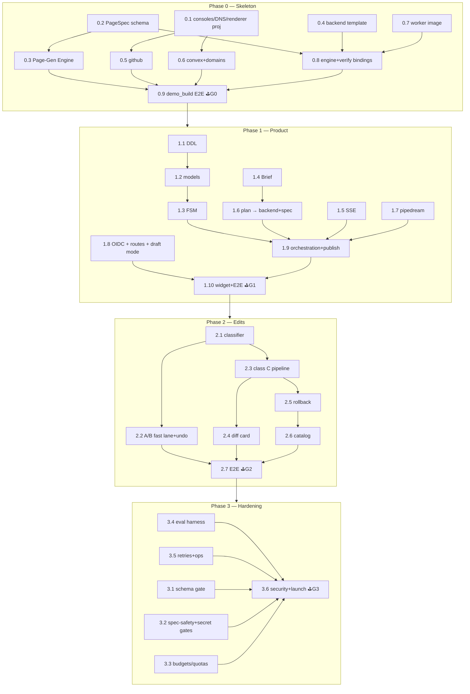
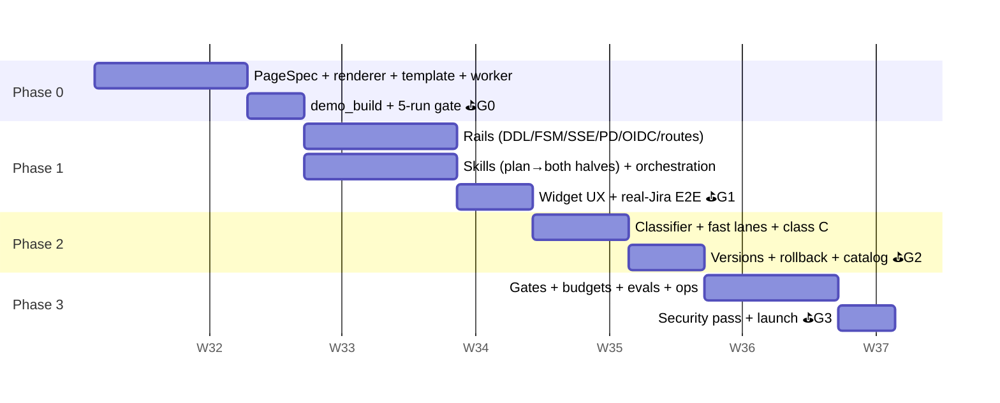

# Ziroo MVP — Master Implementation Plan

> Phase-by-phase execution plan for the MVP defined in
> [`ziroo-mvp-architecture.md`](./ziroo-mvp-architecture.md) (design + rationale live there).
> **Core split:** frontend is never generated — the AI emits/patches a **PageSpec** rendered by
> our **Page-Gen Engine** (one Next.js + shadcn app); only the **Convex backend** is
> code-generated, inside template rails. Each phase has a detailed spec with tasks, exact
> interfaces, code, tests, and an exit gate:
>
> | Phase | Spec | Weeks | Ends with (demo) |
> |---|---|---|---|
> | **0 — Walking Skeleton** | [`ziroo-mvp-phase-0.md`](./ziroo-mvp-phase-0.md) | 1–2 | CLI: hardcoded brief → PageSpec emit + backend gen → **live URL through the renderer** (both bets proven) |
> | **1 — Through the Product** | [`ziroo-mvp-phase-1.md`](./ziroo-mvp-phase-1.md) | 3–5 | Chat: prompt → Jira connect (pause/resume) → streamed stages → approval → **live URL on real Jira data**, SSO |
> | **2 — Versions & Edits** | [`ziroo-mvp-phase-2.md`](./ziroo-mvp-phase-2.md) | 6–7 | **Theme/layout edits live in seconds with undo**; backend edits via preview + English diff; **rollback**; catalog |
> | **3 — Hardening & Launch** | [`ziroo-mvp-phase-3.md`](./ziroo-mvp-phase-3.md) | 8–9 | Nightly **eval report** (backend green rate + spec quality), quotas, schema + spec safety gates, ops page, security pass |

---

## 1 · Operating principles (what makes this plan *progressive*)

1. **Every phase ends in a demo, not a document.**
2. **Risk first:** Phase 0 attacks both existential bets in week 2 — *backend codegen
   reliability* and *catalog expressiveness* — with a numeric 5-run gate, before any product
   surface exists.
3. **Each phase is additive** — later phases wrap earlier artifacts (skills wrap the worker;
   gates wrap verify; lanes wrap the FSM). Rolling back *the plan* stays cheap.
4. **Frontend is data, always.** Any PR that generates UI code is a design bug. New UI needs →
   grow the widget catalog once, every app benefits.
5. **Brief/Spec discipline from day 1:** every version row carries `page_spec_json` (+ Brief);
   class A/B edits are spec patches with version rows; nothing ships without its artifact.
6. **Prompts, template, catalog, and schema are code:** changes merge only with a
   non-regressing eval run (mechanized in Phase 3; manual 5-run measurement from Phase 0).
7. **Buy the undifferentiated parts.** Convex hosts backends, Vercel hosts the ONE renderer,
   Pipedream holds OAuth, GitHub holds versions. Our code: renderer + catalog + spec schema,
   orchestrator FSM, skills/prompts, providers glue, backend template.

## 2 · Dependency graph

Parallelization for 2 engineers — P0: Eng A owns 0.2+0.3 (spec + renderer, the product-grade
craft); Eng B owns 0.1+0.4–0.8 (template, providers, worker); both land 0.9. P1: Eng A skills +
prompts (1.4/1.6/1.9-skills) + renderer draft mode; Eng B rails (1.1/1.2/1.3/1.5/1.7/1.8).
P2/P3: lane-side vs platform-side.

## 3 · Timeline

**~8–9 calendar weeks, 2 engineers** (frontend-codegen removal bought Phase 2 ~3 days; kept as
buffer). Gate may slip ≤3 days by consuming the next phase's start; second slip on the same
gate = scope cut (§6), never a quality cut on the gate itself.

## 4 · Gates (numeric, non-negotiable)

| Gate | Criteria (full lists in phase docs) |
|---|---|
| **G0** | live URL from CLI through the renderer; ≥3/5 runs: backend ≤1 repair AND spec valid ≤2 emits; ≤8 min; ≤$3/run; binding check catches a planted rename; zero secrets |
| **G1** | chat→live on real Jira, zero touches; pod-kill recovery; SSO + role gate; p50 ≤8 min; ≤$4/app |
| **G2** | class A edit ≤10 s live-reflow + undo; classifier 100% on 12-case set (access→C); class C ≤6 min/≤$2 with isolated preview; rollback <1 min |
| **G3** | evals: backend green ≥80%, spec-valid ≥95%, binding-pass 100%; schema + hostile-spec mechanically blocked; quotas product-grade; security checklist green; ops answers in <2 min |

**Kill/pivot criteria:** G0 backend green <50% after tuning or >$10/app → narrow the plan
vocabulary (fewer function shapes) or pre-build common backends as parameterized templates.
G0 catalog can't express the fixture apps → the catalog thesis needs rework *before* product
investment — that's exactly why it's tested in week 2.

## 5 · Risk register (mapped to owning phase)

| # | Risk | Retired by | Mechanism |
|---|---|---|---|
| 1 | **Catalog too narrow** (the #1 bet) | P0 gate, ongoing | fixture apps in week 2; "couldn't express" instrumentation; curated catalog growth |
| 2 | Backend codegen reliability | P0 gate, P3 evals | rails + Chef prompts + binding check + self-heal + nightly measurement |
| 3 | Spec/backend drift | P1 | one plan pass emits both halves; invariant test; verify binding check |
| 4 | Hostile spec content (injection via UI-as-data) | P3 (P0 basics) | sanitization contract + publish chokepoint + abuse dry-runs |
| 5 | Destructive schema edits vs live data | P2 rule, P3 gate | additive-only; ts-morph diff; expand/contract for real changes |
| 6 | Double-provisioning on retries | P1 | FSM StaleTransition + check-then-create |
| 7 | Cross-tenant access | P1 SSO, P3 audit | tenant_id everywhere + CI route tests |
| 8 | Runaway spend | P3 | per-build budget, tenant quotas, ui-edit counter |
| 9 | Renderer as single point of failure | P3 | stateless; canary + Instant Rollback; specVersion gating; smoke-sweep all live specs pre-deploy |
| 10 | Vendor API drift / project caps | all / pre-GA | typed wrappers + [confirm at doc] markers; Convex platform-tier talk during P2/P3 |

## 6 · Scope shield — post-MVP backlog (pre-agreed cuts)

Custom widgets-as-code slot · custom domains per customer · Pipedream webhooks (poll-on-click
now) · per-user connections · central tool-gateway · billing/metering → invoices · RAG · multi-
region · app export · Temporal (if builds outgrow Celery) · template-upgrade replay (backend) ·
moderation tooling beyond ops page.

If a gate slips twice, cut in order — P1: widget polish (keep functional cards) · P2: catalog
UI (keep API + history drawer) · P3: eval briefs 5→3 (never the harness itself).

## 7 · Definition of done (MVP = end of G3)

A tenant can, from Ziroo chat alone: build a real app on their own connected data · watch honest
progress · approve from a plain-English card with a clickable preview · use it at a stable URL
with Ziroo SSO and role gates · **restyle or rearrange it in seconds with undo** · make deeper
changes through previewed, explained edits · roll back · see all apps and versions. The team
can: measure backend-codegen and spec quality nightly · bound spend · debug any build in
minutes · and point at the PageSpec + Brief for every version — the spec-interpreted UI is the
north-star architecture already running in production, with codegen confined to the backend
where it still earns its keep.
