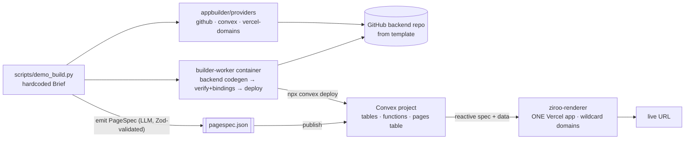

# Phase 0 — Walking Skeleton (Weeks 1–2)

> **For agentic workers:** REQUIRED SUB-SKILL: Use superpowers:subagent-driven-development (recommended) or superpowers:executing-plans to implement this plan task-by-task. Steps use checkbox (`- [ ]`) syntax for tracking.

**Goal:** One command turns a hardcoded App Brief into a live app at a real URL — proving the two bets at once: (1) the **Page-Gen Engine + widget catalog** can express a real internal tool from a **PageSpec**, and (2) the coding agent can reliably generate the **Convex backend** the spec binds to. No chat, no auth, no product surface.

**Architecture:** Four new artifacts: the **Page-Gen Engine** (`ziroo-renderer` — ONE Next.js + shadcn app that interprets PageSpec), the **PageSpec schema** (Zod + exported JSON Schema), the **backend template repo** (`ziroo-backend-template`, Convex-only), and a **builder worker** (container running backend codegen: clone → agent → verify incl. binding check → deploy). A CLI script drives everything.

**Tech Stack:** Python 3.11 (provisioner + worker driver) · Node 20 + pnpm 9 · Next.js 15 App Router + shadcn/ui (renderer only) · Convex 1.x · Zod · Claude Agent SDK (Python) · Docker.

**Demo at exit:** `python scripts/demo_build.py --brief fixtures/briefs/jira_analytics.json` → prints `https://jira-analytics-demo.apps.ziroo.dev` → renderer serves the dashboard (charts + table on seeded data) from the published spec.

## Global Constraints

- **Frontend is data, never code.** Nothing in this system writes React/JS for an app. UI behavior enters the renderer only as a Zod-validated PageSpec. Any task that seems to need generated UI code is a design bug — grow the catalog instead.
- Monorepo layout: control-plane code beside the existing FastAPI app as package `appbuilder/`; worker image pip-installs the same package. `ziroo-renderer` and `ziroo-backend-template` are separate repos.
- Upstream API payloads marked **[confirm at doc]** must be verified against linked docs at implementation time; the wrapper signatures here are the stable contract.
- Provider functions: 30 s timeout, typed `ProviderError(provider, status, body)`, no silent retries.
- Secrets only via env vars; never written into generated repos or specs.
- Model default: `claude-sonnet-5` via `APPBUILDER_MODEL`.
- Naming: GitHub org `ziroo-apps` · backend template `ziroo-backend-template` · backend repos `{tenant_slug}-{app_slug}` · app domains `{app_slug}-{tenant_slug}.apps.ziroo.dev` (all subdomains → the ONE renderer project).

## Environment variables introduced this phase

| Var | Used by | Meaning |
|---|---|---|
| `ZIROO_GH_APP_ID`, `ZIROO_GH_APP_PRIVATE_KEY`, `ZIROO_GH_INSTALLATION_ID`, `ZIROO_GH_ORG=ziroo-apps` | provisioner, worker | GitHub App auth |
| `CONVEX_TEAM_TOKEN`, `CONVEX_TEAM_ID` | provisioner | Convex Management API |
| `VERCEL_TOKEN`, `VERCEL_TEAM_ID`, `RENDERER_PROJECT_ID` | provisioner | Vercel — domain attach onto the renderer project only |
| `APPS_ROOT_DOMAIN=apps.ziroo.dev` | provisioner, renderer | wildcard domain |
| `ANTHROPIC_API_KEY`, `APPBUILDER_MODEL=claude-sonnet-5` | worker | backend codegen engine |

## Architecture (what exists at end of Phase 0)



---

### Task 0.1: Provisioning accounts & console setup (one-time, manual)

**Files:** none (external consoles). Record outcomes in your secrets manager.

**Interfaces:**
- Produces: env vars table populated; wildcard DNS live; **the one renderer Vercel project exists**.

- [ ] **Step 1:** GitHub org `ziroo-apps` + **GitHub App** (permissions `contents:rw`, `administration:rw`, `metadata:r`), installed on org; record App ID, private key, installation ID.
- [ ] **Step 2:** Convex team + team access token ([Management API](https://docs.convex.dev/management-api)); record team id/token.
- [ ] **Step 3:** Vercel team + API token; create empty project `ziroo-renderer` (Task 0.3 pushes into it); record `RENDERER_PROJECT_ID`.
- [ ] **Step 4:** DNS: `apps.ziroo.dev` on Vercel nameservers; add wildcard `*.apps.ziroo.dev` **to the renderer project** ([docs](https://vercel.com/docs/domains/working-with-domains)) — one wildcard covers every app; per-app `add_domain` calls become optional vanity explicit-attaches.
- [ ] **Step 5:** Verify each credential with one curl (list projects / repos). All 200s → done.

---

### Task 0.2: PageSpec schema (`ziroo-renderer/packages/pagespec`)

**Files (inside renderer repo):**
- Create: `packages/pagespec/src/index.ts` (Zod), `packages/pagespec/schema.json` (generated), `packages/pagespec/fixtures/jira-analytics.spec.json`
- Test: `packages/pagespec/test/spec.test.ts` (vitest)

**Interfaces:**
- Produces (consumed by renderer, worker binding-check, and Python control plane via `schema.json`):

```ts
// Layout nodes
type Node = Stack | Grid | Split | Tabs | WidgetNode;
interface Stack  { type: "stack"; id: string; gap?: "sm"|"md"|"lg"; children: Node[] }
interface Grid   { type: "grid";  id: string; cols: 1|2|3|4; children: Node[] }
interface Split  { type: "split"; id: string; ratio?: [number, number]; children: [Node, Node] }
interface Tabs   { type: "tabs";  id: string; items: { label: string; child: Node }[] }
interface WidgetNode { type: "widget"; id: string; widget: WidgetKind; visibleTo?: string[]; config: WidgetConfig }

type WidgetKind = "stat-card"|"chart"|"data-table"|"form"|"detail"|"filter-bar"|"text";

interface Theme { mode: "light"|"dark"|"system"; primary: string; accent: string;
                  radius: "sm"|"md"|"lg"; density: "compact"|"comfortable";
                  font: "inter"|"system"|"mono"; chartPalette: string[] }

interface PageSpec { specVersion: 1; app: string; theme: Theme;
                     nav: { label: string; page: string; icon?: string }[];
                     pages: { id: string; route: string; title: string;
                              visibleTo?: string[]; layout: Node }[] }

export const pageSpecSchema: z.ZodType<PageSpec>;
export function validateSpec(raw: unknown): PageSpec;          // throws readable errors
export function collectBindings(spec: PageSpec): string[];     // every query/mutation name referenced
export function applyPatch(spec: PageSpec, patch: JsonPatchOp[]): PageSpec;  // validate result or throw
```

- [ ] **Step 1:** Failing tests: fixture validates; unknown widget kind rejected; duplicate node id rejected; `collectBindings` returns exact query names; `applyPatch` move-op relocates a node and result re-validates; color values must match `^#[0-9A-Fa-f]{6}$`; markdown/text configs rejected if they contain `<script`.
- [ ] **Step 2:** Implement with Zod; `zod-to-json-schema` generates `schema.json` in build; JSON-Patch via `fast-json-patch`.
- [ ] **Step 3:** Green → commit. Copy `schema.json` into control plane as `appbuilder/pagespec.schema.json` (Python validates with `jsonschema`).

---

### Task 0.3: Page-Gen Engine (`ziroo-renderer`) — the product-grade artifact

**Files (new repo):**
```
ziroo-renderer/
├── middleware.ts                    # subdomain → app_routes lookup (control-plane API, cached)
├── app/
│   ├── [[...path]]/page.tsx         # resolve page by route → <PageRenderer/>
│   ├── layout.tsx                   # AppShell: nav from spec, theme provider
│   └── globals.css                  # base tokens; per-app tokens injected as CSS vars
├── components/
│   ├── ui/…                         # shadcn/ui
│   ├── renderer/
│   │   ├── page-renderer.tsx        # walks layout tree → node components
│   │   ├── node-{stack,grid,split,tabs}.tsx
│   │   └── theme.tsx                # Theme tokens → CSS variables (shadcn theming)
│   └── widgets/
│       ├── registry.ts              # WidgetKind → component (closed catalog)
│       ├── stat-card.tsx  chart.tsx  data-table.tsx
│       ├── form.tsx  detail.tsx  filter-bar.tsx  text.tsx
├── lib/
│   ├── app-context.tsx              # {appId, convexUrl, spec} from middleware headers
│   ├── convex.ts                    # ConvexReactClient per app URL + Ziroo JWT auth
│   └── spec-source.ts               # useQuery(pages table) — reactive spec; ?draft= override (Phase 1)
├── packages/pagespec/…              # Task 0.2
├── scripts/render-smoke.mjs         # SSR every page of a spec with mocked query data; exit ≠0 on error
└── smoke/basic.spec.ts              # Playwright: fixture app renders, no console errors
```

**Interfaces:**
- Consumes: `PageSpec` (0.2); `app_routes` lookup API (Phase 0: a static JSON file / env-mapped stub; Phase 1 makes it a real endpoint).
- Produces: deployed renderer where any `{slug}.apps.ziroo.dev` serves the spec published for that slug; `pnpm smoke:spec --spec <file>` (wraps render-smoke.mjs) that the worker calls in verify.

- [ ] **Step 1:** Scaffold Next.js + shadcn (components: button card table dialog form input select badge tabs chart skeleton sonner); wire the widget catalog to fixture data first (storybook-style fixtures per widget).
- [ ] **Step 2:** `theme.tsx`: map Theme tokens → CSS vars (`--primary`, `--radius`, chart palette vars) per [shadcn theming](https://ui.shadcn.com/docs/theming); `mode` handled with `next-themes`. **This is the "AI updates the CSS" surface — tokens only, no raw stylesheet input.**
- [ ] **Step 3:** `page-renderer.tsx`: recursive walk; unknown node/widget renders an inline "unsupported block" card (spec is validated upstream, this is defense in depth); every widget reads data via `useQuery(spec-bound name, args)`.
- [ ] **Step 4:** `render-smoke.mjs`: `react-dom/server` SSR of every page with a mock Convex provider returning shaped fake rows; fails on throw or missing binding. Fast (<5 s), no browser.
- [ ] **Step 5:** Failing-then-green vitest for: registry completeness (every WidgetKind mapped), theme var mapping, tree walk on the jira fixture. Playwright smoke green on `pnpm dev` with the fixture spec.
- [ ] **Step 6:** Deploy to the `ziroo-renderer` Vercel project; wildcard domain live; fixture app visible at `jira-analytics-demo.apps.ziroo.dev` (stub route map). Commit.

---

### Task 0.4: Backend template repo (`ziroo-backend-template`)

**Files (new repo):**
```
ziroo-backend-template/
├── convex/
│   ├── schema.ts                    # defineSchema stub + REQUIRED `pages` table (published spec)
│   ├── auth.config.ts               # Ziroo customJwt provider (activated Phase 1)
│   ├── pages.ts                     # query: getSpec  · mutation: publishSpec (control-plane key gated)
│   ├── http.ts                      # stub
│   └── lib/
│       ├── pd.ts                    # pdProxy() — ONLY path to third-party APIs (Convex actions)
│       └── authz.ts                 # requireRole(ctx, role)
├── package.json                     # scripts: typecheck (tsc -p convex), lint, function-spec
├── AGENT_RULES.md
└── README.md
```

**Interfaces:**
- Produces: `pdProxy(args)` (same signature as before — see below), `requireRole`, the `pages` table contract the renderer subscribes to: `pages: { spec: v.string() /* JSON */, version: v.string(), publishedAt: v.number() }`.

`convex/lib/pd.ts` (verbatim, the only sanctioned third-party path):

```ts
"use node";
export interface PdProxyArgs {
  accountId: string; externalUserId: string;
  url: string; method: "GET"|"POST"|"PUT"|"DELETE";
  body?: unknown; headers?: Record<string, string>;
}
export async function pdProxy<T>(args: PdProxyArgs): Promise<T> {
  const base = `https://api.pipedream.com/v1/connect/${process.env.PD_PROJECT_ID}/proxy`;
  const target = encodeURIComponent(btoa(args.url));
  const res = await fetch(`${base}/${target}?external_user_id=${args.externalUserId}&account_id=${args.accountId}`, {
    method: args.method,
    headers: { Authorization: `Bearer ${await pdAccessToken()}`,
               "x-pd-environment": process.env.PD_ENV ?? "production",
               "Content-Type": "application/json", ...args.headers },
    body: args.body ? JSON.stringify(args.body) : undefined,
  });
  if (!res.ok) throw new Error(`pdProxy ${res.status}: ${await res.text()}`);
  return (await res.json()) as T;
} // pdAccessToken(): client-credentials token, cached — https://pipedream.com/docs/connect/api-ref [confirm at doc]
```

`AGENT_RULES.md` (verbatim start):

```markdown
# Rules for the coding agent (non-negotiable)

1. You write BACKEND ONLY: convex/schema.ts, queries, mutations, actions, crons, seed.
   You never write UI code of any kind. The UI is a PageSpec rendered elsewhere.
2. Implement EXACTLY the function names and arg/return shapes in the plan — the PageSpec
   binds to those names; a rename breaks the app (verify will catch it, don't make it).
3. Every table gets tenantId: v.string(); every query/mutation filters by it.
4. Third-party APIs: ONLY via pdProxy() from convex/lib/pd.ts, ONLY inside actions.
5. Auth: ctx.auth.getUserIdentity(); gate with requireRole(ctx, "…"). Never build login.
6. Schema changes on an EXISTING app: additive only — add tables or optional fields.
   Never rename, retype, or delete a field.
7. Recurring work: Convex scheduled functions (crons.ts). Include a seed function that
   populates plausible fake data for previews.
8. Do not touch: pages.ts, auth.config.ts, lib/. Before finishing: pnpm typecheck green.
```

- [ ] **Step 1:** Build the repo; `pnpm typecheck` green on pristine template; mark as GitHub template repo.
- [ ] **Step 2:** `function-spec` script: `npx convex function-spec --prod=false` **[confirm command at doc]** emitting the function list as JSON for the worker's binding check.
- [ ] **Step 3:** Commit.

---

### Task 0.5: Provider client — GitHub (`appbuilder/providers/github.py`)

**Files:** Create `appbuilder/providers/github.py`, `appbuilder/providers/base.py` · Test `tests/appbuilder/providers/test_github.py` (respx)

**Interfaces:**
- Produces:
```python
class ProviderError(Exception): ...
def installation_token() -> str
def create_repo_from_template(name: str) -> RepoInfo   # RepoInfo(full_name, clone_url, default_branch); template = ziroo-backend-template
def merge_branch(repo_full_name: str, head: str, base: str = "main") -> str   # returns merge sha (used Phase 1+)
def delete_repo(full_name: str) -> None                 # cleanup only
```

- [ ] **Step 1:** Failing respx tests: app-JWT → installation token cached; `create_repo_from_template` POSTs `/repos/{org}/ziroo-backend-template/generate` ([docs](https://docs.github.com/en/rest/repos/repos#create-a-repository-using-a-template)); `merge_branch` POSTs `/repos/{repo}/merges`.
- [ ] **Step 2:** Implement (PyJWT RS256, 9-min exp). **Step 3:** Green → commit.

---

### Task 0.6: Provider clients — Convex + Vercel domains

**Files:** Create `appbuilder/providers/convex.py`, `appbuilder/providers/vercel.py` · Tests (respx) for both

**Interfaces:**
- Produces:
```python
# convex.py — Management API [confirm endpoints at doc: https://docs.convex.dev/management-api]
def create_project(name: str) -> ConvexProject          # ConvexProject(project_id, deploy_key, convex_url)

# vercel.py — the renderer is the only project; per-app work is domain attach at most
def add_app_domain(subdomain: str) -> None              # POST /v10/projects/{RENDERER_PROJECT_ID}/domains {"name": f"{subdomain}.{APPS_ROOT_DOMAIN}"}
def renderer_latest_deployment() -> Deployment          # health/rollback info for the renderer itself
```
Everything else Convex-side (env vars, deploys) happens in the worker via `npx convex …` with the deploy key — CLI is the stable contract.

- [ ] **Step 1:** Failing tests for both wrappers. **Step 2:** Implement. **Step 3:** Green → commit.

---

### Task 0.7: Builder worker — image + workspace

**Files:** Create `builder-worker/Dockerfile`, `builder-worker/jobs/workspace.py` · Test `tests/builder/test_workspace.py` (local bare-repo fixture, no network)

**Interfaces:**
- Produces:
```python
@dataclass
class Workspace: dir: Path; repo: str; branch: str
def prepare(repo_full_name: str, branch: str, base: str = "main") -> Workspace
def push(ws: Workspace, message: str) -> str            # commit-all + push → sha
def cleanup(ws: Workspace) -> None                      # always in finally
```

- [ ] **Step 1:** Dockerfile — node20-slim + git + python3 + pnpm via corepack + pip-install shared `appbuilder` package; non-root `builder` user. (No Playwright/browsers needed — render smoke is SSR and runs in the renderer repo's CI + control-plane side.)
- [ ] **Step 2:** Failing tests: `prepare` clones+branches; `push` returns visible sha; `cleanup` removes dir.
- [ ] **Step 3:** Implement (`subprocess.run(["git", …], check=True, timeout=120)`; identity `ziroo-builder[bot]`; token via `x-access-token:` URL, never logged). Green → commit.

---

### Task 0.8: Builder worker — engine + verify (self-heal + binding check)

**Files:** Create `builder-worker/jobs/engine.py`, `builder-worker/jobs/verify.py`, `prompts/appbuilder/generate_system.md` · Test `tests/builder/test_verify.py`

**Interfaces:**
- Consumes: `Workspace` (0.7); `pagespec.json` + `plan.json` written into the job dir by the driver.
- Produces:
```python
# engine.py — Claude Agent SDK, headless in the workspace [confirm option names: https://docs.claude.com/en/api/agent-sdk/python]
async def run_agent(ws: Workspace, task_md: str, budget_turns: int = 60) -> EngineResult
# EngineResult(ok, turns, cost_usd, transcript_path)

# verify.py
def verify(ws: Workspace, spec_bindings: list[str]) -> VerifyResult
# runs: pnpm typecheck · pnpm function-spec → assert set(spec_bindings) ⊆ functions
# VerifyResult(ok, failed_step, stderr_tail, missing_bindings)
async def generate_with_selfheal(ws, task_md, spec_bindings, max_repairs: int = 2) -> BuildOutcome
```

- [ ] **Step 1:** Failing tests: typecheck failure → stderr_tail captured; missing binding `issues.cycleP50` → `missing_bindings=["issues.cycleP50"]` and repair prompt names it; fail→repair→green counts `attempts == 2`.
- [ ] **Step 2:** Implement engine (`ClaudeAgentOptions(cwd=ws.dir, model=$APPBUILDER_MODEL, permission_mode="acceptEdits", allowed_tools=[Read,Write,Edit,Bash,Grep,Glob], max_turns=…, system_prompt=generate_system.md + AGENT_RULES.md)`); transcript + cost captured.
- [ ] **Step 3:** `generate_system.md` seeded from **Chef's published prompt pack** ([releases](https://github.com/get-convex/chef/releases)): Convex validators/schema style, queries vs mutations vs actions, crons — plus: "backend only; implement the plan's function names exactly."
- [ ] **Step 4:** Green → commit.

---

### Task 0.9: Deploy + spec publish + `demo_build.py` — the Phase-0 exit gate

**Files:** Create `builder-worker/jobs/deploy.py`, `appbuilder/specs.py`, `scripts/demo_build.py`, `fixtures/briefs/jira_analytics.json`

**Interfaces:**
- Produces:
```python
# deploy.py
def convex_deploy(ws: Workspace, deploy_key: str, env: dict[str, str], preview: str | None = None) -> str  # env via `npx convex env set`; deploy prod or --preview-create [confirm at doc]

# appbuilder/specs.py  (control-plane side)
def emit_pagespec(brief: dict, plan: dict) -> dict      # LLM → JSON → validate against pagespec.schema.json (1 retry with errors)
def publish_spec(convex_url: str, admin_key: str, spec: dict, version: str) -> None   # calls pages.publishSpec
```

- [ ] **Step 1:** `fixtures/briefs/jira_analytics.json` — same golden brief as before (`mode: "seeded_fake"`: Phase 0 has no Pipedream; the agent generates a seed function with 200 plausible issues; Phase 1 flips to live sync).
- [ ] **Step 2:** `demo_build.py` — the whole pipeline, sequential and loud:

```python
brief = json.loads(Path(args.brief).read_text())
plan  = make_backend_plan(brief)                 # Phase 0: cheap-model call or handwritten plan fixture
spec  = emit_pagespec(brief, plan)               # UI as data — validated
repo  = github.create_repo_from_template(f"{brief['slug']}-demo")
cx    = convex.create_project(f"{brief['slug']}-demo")
vercel.add_app_domain(f"{brief['slug']}-demo")   # routes to the renderer
routes.put_stub(f"{brief['slug']}-demo", cx.convex_url)  # Phase-0 static route map for middleware
ws = workspace.prepare(repo.full_name, branch="build/demo")
outcome = asyncio.run(engine.generate_with_selfheal(ws, plan_to_task_md(brief, plan),
                                                    spec_bindings=collect_bindings(spec)))
assert outcome.ok, outcome.failure
deploy.convex_deploy(ws, cx.deploy_key, env={"PD_PROJECT_ID": "unused-phase0"})
workspace.push(ws, "feat: initial backend")
specs.publish_spec(cx.convex_url, cx.deploy_key, spec, version="v1")
run(["node", "ziroo-renderer/scripts/render-smoke.mjs", "--spec", spec_path])   # SSR smoke
print("LIVE:", f"https://{brief['slug']}-demo.{os.environ['APPS_ROOT_DOMAIN']}")
```

- [ ] **Step 3:** Run for real; debug until the URL renders the dashboard on seeded data.
- [ ] **Step 4:** Run **5 times**; record: backend first-pass green, repairs, spec-valid-on-first-emit, wall time, cost → `docs/phase0-results.md`.
- [ ] **Step 5:** Teardown script (delete repos/projects/domains). Tag `phase-0-done`.

---

## Exit criteria (Gate G0)

- [ ] Renderer deployed; fixture spec renders via wildcard subdomain; `render-smoke` green.
- [ ] `demo_build.py` → live URL end-to-end; **≥3/5 runs: backend needs ≤1 repair AND spec valid on ≤2 emit attempts**; wall ≤ 8 min; ≤ $3/run.
- [ ] Binding check demonstrably catches a planted rename (manual test).
- [ ] Zero secrets in generated repos/specs (grep audit).

**If G0 fails on backend codegen** → tune rails/prompts before Phase 1. **If it fails on spec
expressiveness** (fixture app can't be expressed) → grow the catalog now; that's the point of
testing it first.

## Risks specific to this phase

| Risk | Watch for | Response |
|---|---|---|
| Catalog can't express the fixture app | render-smoke "unsupported" hits | add/extend widget once — benefits every future app |
| Agent invents function names | binding check failures | repair prompt names the exact missing bindings; tighten plan wording |
| Convex Management API drift | 4xx on create_project | wrapper isolates; fallback pre-provisioned pool for demo |
| Wildcard DNS/SSL delay | domain 404 | wildcard attached once in 0.1 — verify early |
