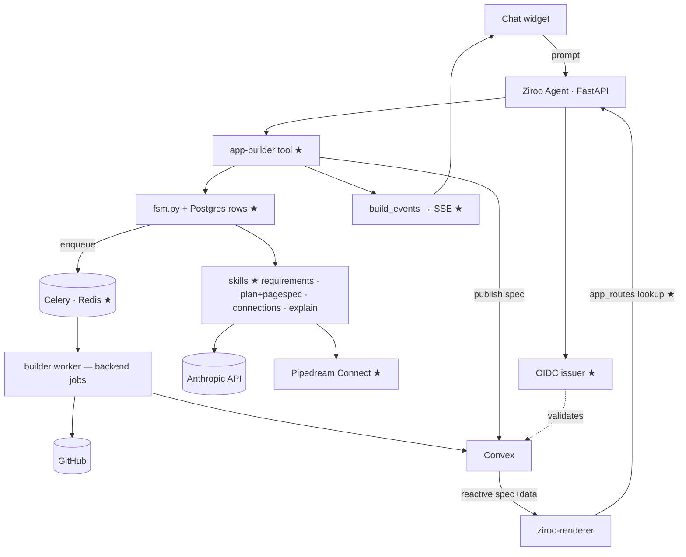

# Phase 1 — Through the Product (Weeks 3–5)

> **For agentic workers:** REQUIRED SUB-SKILL: Use superpowers:subagent-driven-development (recommended) or superpowers:executing-plans to implement this plan task-by-task. Steps use checkbox (`- [ ]`) syntax for tracking.

**Goal:** The Jira-analytics demo works **from chat**: prompt → requirements → Jira connect (pause/resume) → provision → backend generate + PageSpec emit → verify (bindings + render smoke) → preview → plain-English approval → spec published + backend live — every stage streamed to the widget, on real Jira data, with SSO.

**Architecture:** The `app-builder` tool joins the existing Ziroo agent. A **build FSM** in Postgres drives stages; **Celery + Redis** dispatches backend jobs to the Phase-0 worker; **build events** stream over SSE. The **plan skill emits two artifacts from one Brief** — backend plan and PageSpec — bound by a query-name contract. Ziroo becomes an **OIDC issuer**; the renderer gets its real **`app_routes` lookup API** and a **draft-spec preview mode**.

**Tech Stack:** adds Celery 5 + Redis 7 · SQLAlchemy 2 + Alembic · Pydantic v2 · `jsonschema` (PageSpec validation, Python side) · `python-jose[cryptography]`.

**Demo at exit:** In chat: *"build an analytics tool on our Jira data"* → clarifying Qs → Connect card → authorize → stages stream → approval card with preview link (renderer @ draft spec on preview backend) → Approve → **live URL on real Jira data**.

## Global Constraints

- Phase-0 constraints apply (frontend is data; providers; secrets; naming; model).
- Every FSM transition idempotent + audited via `build_events`; replayed Celery tasks must not double-provision.
- Chat never blocks: human waits = `waiting_user` park + resume endpoint.
- LLM skill calls: temperature ≤ 0.3; JSON validated (Pydantic / pagespec JSON Schema); one retry with validation errors appended; cost accumulated on the build row.
- New env vars: `PD_CLIENT_ID`, `PD_CLIENT_SECRET`, `PD_PROJECT_ID`, `PD_ENV=production`, `ZIROO_ISSUER_URL=https://auth.ziroo.dev`, `APPBUILDER_ENC_KEY` (Fernet), `OIDC_SIGNING_KEY_PEM`, `ROUTES_API_KEY` (renderer ↔ control plane).

## Architecture (delta from Phase 0)



### Build FSM (canonical)

```
RECEIVED → BRIEF → CONNECTIONS → PROVISION → GENERATE → VERIFY → PREVIEW → APPROVAL → DEPLOY → LIVE
BRIEF/CONNECTIONS/APPROVAL may park: state=waiting_user · GENERATE/VERIFY self-heal ≤2
any stage → NEEDS_ATTENTION (retryable) | FAILED (terminal)
```

---

### Task 1.1: Control-plane schema (Alembic migration)

**Files:** Create `appbuilder/migrations/versions/0001_appbuilder_tables.py` · Test `tests/appbuilder/test_migration.py`

**Interfaces:** Exact DDL all later tasks rely on:

```sql
CREATE TABLE ab_apps (
  id uuid PRIMARY KEY DEFAULT gen_random_uuid(),
  tenant_id uuid NOT NULL,
  name text NOT NULL, slug text NOT NULL,
  status text NOT NULL DEFAULT 'building',            -- building|live|needs_attention|archived
  repo_full_name text,
  convex_project_id text, convex_deploy_key_enc bytea, convex_url text,
  prod_url text, current_version_id uuid,
  brief_json jsonb NOT NULL DEFAULT '{}',
  created_by uuid NOT NULL,
  created_at timestamptz NOT NULL DEFAULT now(), updated_at timestamptz NOT NULL DEFAULT now(),
  UNIQUE (tenant_id, slug)
);
CREATE INDEX ab_apps_tenant_idx ON ab_apps (tenant_id);

CREATE TABLE ab_app_versions (
  id uuid PRIMARY KEY DEFAULT gen_random_uuid(),
  app_id uuid NOT NULL REFERENCES ab_apps(id),
  semver text NOT NULL,
  kind text NOT NULL DEFAULT 'full',                  -- full | ui_patch
  git_tag text, git_sha text,                          -- null for ui_patch
  page_spec_json jsonb NOT NULL,                       -- spec is ALWAYS versioned data
  brief_json jsonb NOT NULL, plan_json jsonb,
  changelog_md text NOT NULL DEFAULT '',
  status text NOT NULL DEFAULT 'preview',              -- preview|live|superseded|rolled_back
  approved_by uuid,
  created_at timestamptz NOT NULL DEFAULT now(),
  UNIQUE (app_id, semver)
);

CREATE TABLE ab_builds (
  id uuid PRIMARY KEY DEFAULT gen_random_uuid(),
  app_id uuid NOT NULL REFERENCES ab_apps(id),
  tenant_id uuid NOT NULL,
  kind text NOT NULL,                                  -- create | edit | ui_edit | rollback
  stage text NOT NULL DEFAULT 'received',
  state text NOT NULL DEFAULT 'running',               -- running|waiting_user|needs_attention|failed|done
  branch text, prompt_text text NOT NULL,
  brief_json jsonb, plan_json jsonb, page_spec_json jsonb,
  error_ctx jsonb,
  token_cost_usd numeric(10,4) NOT NULL DEFAULT 0,
  created_at timestamptz NOT NULL DEFAULT now(), updated_at timestamptz NOT NULL DEFAULT now()
);
CREATE INDEX ab_builds_app_idx ON ab_builds (app_id, created_at DESC);
CREATE INDEX ab_builds_active_idx ON ab_builds (state) WHERE state IN ('running','waiting_user');

CREATE TABLE ab_build_events (
  id bigserial PRIMARY KEY,
  build_id uuid NOT NULL REFERENCES ab_builds(id),
  ts timestamptz NOT NULL DEFAULT now(),
  stage text NOT NULL, level text NOT NULL DEFAULT 'info',
  message_md text NOT NULL
);
CREATE INDEX ab_build_events_build_idx ON ab_build_events (build_id, id);

CREATE TABLE ab_app_connections (
  id uuid PRIMARY KEY DEFAULT gen_random_uuid(),
  tenant_id uuid NOT NULL, app_id uuid REFERENCES ab_apps(id),
  pd_app_slug text NOT NULL, pd_account_id text NOT NULL,
  status text NOT NULL DEFAULT 'active',
  created_at timestamptz NOT NULL DEFAULT now(),
  UNIQUE (tenant_id, pd_app_slug, pd_account_id)
);

CREATE TABLE ab_app_routes (
  subdomain text PRIMARY KEY,                          -- 'jira-analytics-acme'
  app_id uuid NOT NULL REFERENCES ab_apps(id),
  convex_url text NOT NULL
);
```

- [ ] **Step 1:** Write migration exactly. **Step 2:** Test upgrade/downgrade. **Step 3:** Commit.

---

### Task 1.2: Models + crypto

**Files:** `appbuilder/models.py`, `appbuilder/crypto.py` · Test `tests/appbuilder/test_crypto.py`

**Interfaces:** SQLAlchemy models `App, AppVersion, Build, BuildEvent, AppConnection, AppRoute` mapping 1.1 exactly; `encrypt(str)->bytes` / `decrypt(bytes)->str` (Fernet on `APPBUILDER_ENC_KEY`).

- [ ] Steps: failing round-trip + tamper test → implement → green → commit.

---

### Task 1.3: FSM

**Files:** `appbuilder/fsm.py` · Test `tests/appbuilder/test_fsm.py`

**Interfaces:**
```python
class Stage(str, Enum): received; brief; connections; provision; generate; verify; preview; approval; deploy; live
class BuildState(str, Enum): running; waiting_user; needs_attention; failed; done
def advance(db, build_id, from_stage: Stage) -> Stage      # atomic UPDATE WHERE stage=from_stage; raises StaleTransition
def park(db, build_id, reason_md) -> None
def resume(db, build_id) -> None
def fail(db, build_id, error_ctx, retryable: bool) -> None
```

- [ ] **Step 1: Failing tests (exemplar TDD unit):**

```python
def test_advance_moves_one_stage(db, build):
    assert fsm.advance(db, build.id, Stage.received) == Stage.brief

def test_advance_is_idempotent_guarded(db, build):
    fsm.advance(db, build.id, Stage.received)
    with pytest.raises(fsm.StaleTransition):
        fsm.advance(db, build.id, Stage.received)      # replayed task must not re-run

def test_park_and_resume(db, build):
    fsm.park(db, build.id, "waiting for Jira connect")
    assert db.get(Build, build.id).state == "waiting_user"
    fsm.resume(db, build.id)
    assert db.get(Build, build.id).state == "running"
```

- [ ] **Step 2:** Implement (single `UPDATE … RETURNING`; every mutation emits a BuildEvent). **Step 3:** Green → commit.

---

### Task 1.4: App Brief schema

**Files:** `appbuilder/briefs.py` · Test `tests/appbuilder/test_briefs.py`

**Interfaces (canonical Brief — skills emit it, PageSpec + plan derive from it, Phase 2 diffs it):**

```python
class DataSource(BaseModel):
    provider: str; objects: list[str]; sync_minutes: int = 15
    mode: Literal["live", "seeded_fake"] = "live"

class Entity(BaseModel): name: str; fields: list[str]
class PageReq(BaseModel):
    kind: Literal["dashboard","table","form","detail"]; title: str
    entity: str | None = None; metrics: list[str] = []
class Role(BaseModel): name: str; can: list[str]

class AppBrief(BaseModel):
    version: int = 1; name: str
    slug: str                                # ^[a-z0-9-]{3,40}$
    purpose: str
    data_sources: list[DataSource] = []
    entities: list[Entity]; pages: list[PageReq]; roles: list[Role]

def parse_brief(raw) -> AppBrief             # BriefValidationError with readable messages
```

- [ ] Steps: failing tests (fixture parses; bad slug/kind rejected) → implement → green → commit.

---

### Task 1.5: Build events + SSE stream

**Files:** `appbuilder/events.py`, extend `appbuilder/api.py` · Test `tests/appbuilder/test_events_api.py`

**Interfaces:**
```python
def emit(db, build_id, stage: Stage, message_md: str, level: str = "info") -> None
GET /api/internal/app-builder/builds/{id}/events        # SSE: replay after ?after_id, then live (redis pubsub); 15 s heartbeat
```
Wire format: `data: {"id":123,"stage":"generate","level":"info","message_md":"…","ts":"…"}`

- [ ] Steps: failing replay-order test → implement → green → commit.

---

### Task 1.6: Skills — `requirements`, `plan` (emits BOTH halves)

**Files:** `appbuilder/skills/requirements.py`, `appbuilder/skills/plan.py`, `appbuilder/specs.py` (from 0.9, now productionized), `prompts/appbuilder/requirements.md`, `prompts/appbuilder/plan.md`, `prompts/appbuilder/pagespec.md` · Tests (LLM mocked)

**Interfaces:**
```python
# requirements.py
def next_action(prompt_history: list[dict]) -> Ask(question_md) | Ready(brief: AppBrief)

# plan.py — ONE brief in, TWO validated artifacts out
def make_plan(brief: AppBrief) -> PlanBundle
# PlanBundle(backend_plan: dict, page_spec: dict, bindings: list[str])
# backend_plan: {"schema":[…], "functions":[{"name":"issues.throughputWeekly","kind":"query","args":…,"returns":…}], "crons":[…], "seed":true}
# page_spec: validated against pagespec.schema.json
# INVARIANT (tested): collect_bindings(page_spec) ⊆ {f.name for f in backend_plan.functions}
```

- [ ] **Step 1:** `requirements.md`: "≤1 question per turn, only if it changes what gets built; never ask about tech/design; else output AppBrief JSON only."
- [ ] **Step 2:** `plan.md` + `pagespec.md`: backend plan first (function names are the contract), then PageSpec binding **only** those names; theme defaults from Ziroo brand unless the user asked for colors.
- [ ] **Step 3:** Failing tests: ambiguous → Ask; complete → Ready; plan bundle invariant holds; LLM emits unknown binding → one retry with the violation named (assert 2 calls); invalid spec JSON → retry with Zod/jsonschema errors.
- [ ] **Step 4:** Implement (Anthropic client, JSON mode, cost accounting). Green → commit.

---

### Task 1.7: Pipedream provider + `connections` skill + resume

**Files:** `appbuilder/providers/pipedream.py`, `appbuilder/skills/connections.py`, extend `appbuilder/api.py` · Tests (respx / skill-level)

**Interfaces:**
```python
# providers/pipedream.py — https://pipedream.com/docs/connect/api-ref [confirm at doc]
def access_token() -> str
def list_accounts(external_user_id: str, app_slug: str) -> list[PdAccount]   # PdAccount(account_id, healthy)
def create_connect_link(external_user_id: str, app_slug: str) -> str

# skills/connections.py
def ensure_connections(db, build) -> Connected(map) | NeedsConnect(links)
POST /api/internal/app-builder/builds/{id}/resume       # "I've connected" → re-check → advance or re-park
```

- [ ] Steps: failing provider tests → failing skill tests (connected persists to `ab_app_connections`; missing parks build) → implement (`external_user_id = str(tenant_id)`; poll-on-click, no webhook in MVP) → green → commit.

---

### Task 1.8: Ziroo OIDC issuer + routes API + renderer wiring

**Files:** `auth_oidc/{keys,issuer,api}.py` · extend `appbuilder/api.py` (routes endpoint) · Renderer: activate `auth.config.ts` consumption, real middleware lookup, `?draft=` mode · Tests both sides

**Interfaces:**
```
GET  /.well-known/openid-configuration · GET /.well-known/jwks.json
POST /api/internal/app-builder/app-token                 # session → {"token": jwt}
     claims: iss=$ZIROO_ISSUER_URL, aud="ziroo-apps", sub, tenant_id, email, name, roles[], exp+1h, kid

GET  /api/internal/app-builder/routes/{subdomain}        # X-Routes-Key: $ROUTES_API_KEY → {app_id, convex_url}
GET  /api/internal/app-builder/specs/{version_id}        # draft spec for preview (session OR routes-key auth)
```
Renderer: middleware queries routes endpoint (60 s in-memory cache); `spec-source.ts` supports `?draft={version_id}` → fetches draft from control plane instead of the app's `pages` table; `lib/convex.ts` fetches app-token (redirect to Ziroo login on 401) → `setAuth`. Backend template `auth.config.ts` (activated):

```ts
export default { providers: [{ type: "customJwt",            // [confirm shape at doc]
  issuer: process.env.ZIROO_ISSUER_URL!,
  jwks: `${process.env.ZIROO_ISSUER_URL}/.well-known/jwks.json`,
  applicationID: "ziroo-apps", algorithm: "RS256" }] };
```

- [ ] **Step 1:** Failing issuer tests: jwks serves key; minted token verifies (python-jose); wrong aud rejected.
- [ ] **Step 2:** Failing routes tests: unknown subdomain 404; key required.
- [ ] **Step 3:** Implement all; integration-test the JWT against a scratch Convex deployment before template rollout.
- [ ] **Step 4:** Green both repos → commit.

---

### Task 1.9: Orchestration — tool entry, Celery tasks, publish, approval, explain

**Files:** `appbuilder/tool.py`, `appbuilder/tasks.py`, `appbuilder/skills/explain.py`, `prompts/appbuilder/explain.md`, extend `appbuilder/api.py` · Test `tests/appbuilder/test_orchestration.py` (Celery eager, providers+engine faked)

**Interfaces:**
```python
# tool.py — registered in the agent's tool registry
def handle_app_builder(tenant_id, user_id, message, session) -> ToolReply

# tasks.py (queue="skills" core-side · queue="builds" worker container)
@app.task def drive_build(build_id)     # brief → connections → (park | plan bundle → provision)
@app.task def run_provision(build_id)   # repo · convex project · ab_app_routes row · add_app_domain; env incl. PD_*, ZIROO_ISSUER_URL
@app.task def run_generate(build_id)    # workspace + engine + verify(bindings) + convex preview deploy + push branch
@app.task def run_deploy(build_id)      # merge→main · tag v1 · convex prod deploy · publish_spec(v1) · first sync kick · LIVE

POST /api/internal/app-builder/builds/{id}/approve | reject

# skills/explain.py
def approval_card(brief, plan_bundle, preview_url) -> str
# preview_url = f"https://{subdomain}.{APPS_ROOT_DOMAIN}?draft={version_id}&backend=preview"
```

- [ ] **Step 1:** Failing walk test: complete prompt → stages `received→…→approval` in events, parked at approval; `approve` → `deploy→live`; `ab_app_versions` v1 (`kind=full`, spec present); `ab_apps.status=live`.
- [ ] **Step 2:** Failing park test: missing connection parks; `resume` continues.
- [ ] **Step 3:** Implement. Partial-failure rule: backend verify green but sync cron unverifiable → deploy anyway, app `needs_attention`, event explains. Every task try/except → `fsm.fail(retryable=True)` + error event.
- [ ] **Step 4:** `explain.md`: non-engineer card — What it does · What it stores · Who sees what · External access (provider, read/write) · What to check in preview. ≤180 words. Access section rendered mechanically from Brief roles (never LLM-omittable).
- [ ] **Step 5:** Green → commit.

---

### Task 1.10: Chat widget UX + real E2E — the Phase-1 exit gate

**Files:** Widget (existing chat frontend): stage timeline, connect card, approval card

- [ ] **Step 1:** Widget renders SSE timeline (spinner/check/warn per stage), Connect card (link + "I've connected" resume), Approval card (markdown + Preview + Approve/Reject). Interaction design per `ziroo-prototype.html`.
- [ ] **Step 2:** Real E2E on a Jira sandbox: sentence → connect → approve → live URL shows real issues after first sync; second tenant user opens URL → SSO'd; role-less user sees "forbidden".
- [ ] **Step 3:** Failure drill: revoke Jira mid-build → `needs_attention` with readable event; retry works.
- [ ] **Step 4:** Record timings/cost → `docs/phase1-results.md`; tag `phase-1-done`.

## Exit criteria (Gate G1)

- [ ] Chat → live URL, zero engineer touches, real Jira data.
- [ ] Pod-kill mid-GENERATE → clean resume/retry, no duplicate repos/projects.
- [ ] SSO + role gate proven; secrets absent from repo and spec.
- [ ] p50 chat→live ≤ 8 min; cost/app ≤ $4 (backend-only codegen is cheaper than v1 plan).

## Risks specific to this phase

| Risk | Response |
|---|---|
| Plan bundle drift (spec binds missing function) | invariant test + verify binding check + retry-with-violation |
| Requirements over-asking | hard cap ≤3 questions; tune on 10 sample prompts |
| customJwt config mismatch | scratch-deployment integration test in 1.8 before rollout |
| Celery replay double-provisions | `StaleTransition` + check-then-create by name |
| Renderer routes cache staleness | 60 s TTL + explicit bust on provision |
