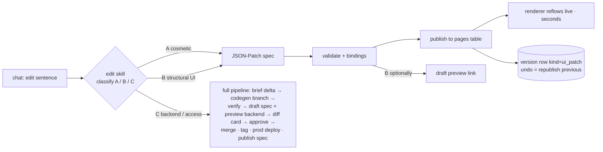

# Phase 2 — Versions & Edits (Weeks 6–7)

> **For agentic workers:** REQUIRED SUB-SKILL: Use superpowers:subagent-driven-development (recommended) or superpowers:executing-plans to implement this plan task-by-task. Steps use checkbox (`- [ ]`) syntax for tracking.

**Goal:** Live apps change from chat through **three lanes**: cosmetic/layout edits apply in **seconds with undo** (spec patch, no build); structural-UI edits validate + optionally preview; backend edits run the full pipeline with an English semantic diff and approval. Everything is versioned; rollback is one click.

**Architecture:** The **edit skill classifies** every request (A cosmetic · B structural-UI · C backend). Class A/B are **inline spec operations** — JSON-Patch → Zod/schema validate → binding check → publish to the app's `pages` table → renderer reflows live (it subscribes). Class C reuses the Phase-1 pipeline on a branch with **draft-spec + preview-backend** previews. An app version = (backend git tag?, PageSpec version) pair — `ui_patch` versions have no tag.

**Tech Stack:** no new infrastructure.

**Demo at exit:** *"make it dark blue"* → restyled in seconds → "undo" works. *"move the chart above the stat cards"* → reflows live. *"add sprint velocity and let team leads see it"* → classified C (access change) → preview → diff card → Approve → v3 live. *"roll back to v2"* → done in <1 min.

## Global Constraints

- Phases 0–1 constraints apply.
- **Brief/Spec discipline:** no change ships without its artifact updated — class A/B update `page_spec_json` (new version row, `kind=ui_patch`); class C updates Brief + plan + spec (`kind=full`). `ab_app_versions` is always the truth.
- **Access changes are ALWAYS class C** — even a one-word "let team leads see it". Permission is what the approval gate exists for. The classifier is tested on this.
- **Additive-only schema rule** (backend edits): adds allowed; rename/retype/delete refused with explanation; mechanical gate lands in Phase 3, prompt + card wording enforce now.
- Class A/B run inline in the API process (< 1 s target); only class C touches the queue.

## Architecture (edit lanes)



---

### Task 2.1: Edit skill — locate, classify, delta

**Files:** Create `appbuilder/skills/edit.py`, `prompts/appbuilder/edit.md` · Test `tests/appbuilder/skills/test_edit.py` (LLM mocked)

**Interfaces:**
```python
class EditClass(str, Enum): cosmetic = "A"; structural_ui = "B"; backend = "C"

class UiEdit(BaseModel):
    edit_class: Literal["A", "B"]
    patch: list[dict]                 # JSON-Patch ops against current page_spec_json
    summary_md: str                   # "Theme → dark blue" / "Moved trend chart above stat row"

class BackendEdit(BaseModel):
    edit_class: Literal["C"]
    brief_delta: BriefDelta           # adds/changes/removes on the AppBrief (removes.schema → RejectedEdit)
    summary_md: str

class BriefDelta(BaseModel):
    adds: dict; changes: dict; removes: dict; summary_md: str

def resolve_target_app(db, tenant_id, message) -> App | Ambiguous(options)
def classify_and_delta(app, message) -> UiEdit | BackendEdit | RejectedEdit(reason_md)
```
Classifier rules (in `edit.md`, and unit-tested): theme/copy/move/resize/reorder → A · add/remove/configure widgets **using existing bindings only** → B · anything touching entities, queries, sync, or **roles/visibility** → C · destructive schema asks → RejectedEdit with the additive-rule explanation.

- [ ] **Step 1:** Failing tests: "dark blue" → A with a `replace /theme/primary` op; "move chart above stats" → A with a move op; "add a table of unresolved bugs" (query exists) → B; "add sprint velocity" (no such query) → C; **"let team leads see it too" → C**; "delete the storyPoints field" → RejectedEdit; ambiguous app → Ambiguous.
- [ ] **Step 2:** Implement; patch ops validated by dry-running `apply_patch` (pagespec pkg semantics mirrored in Python via `jsonpatch` + jsonschema).
- [ ] **Step 3:** Green → commit.

---

### Task 2.2: Class A/B fast lane — apply, version, undo

**Files:** Create `appbuilder/uiedits.py`, extend `appbuilder/api.py` · Test `tests/appbuilder/test_uiedits.py`

**Interfaces:**
```python
def apply_ui_edit(db, app, edit: UiEdit, user_id) -> AppVersion
# 1 patch → 2 validate (jsonschema) → 3 binding check vs stored plan functions →
# 4 new ab_app_versions row (kind=ui_patch, semver bump, status=live; previous → superseded) →
# 5 publish_spec(app.convex_url, …) → 6 ab_builds row (kind=ui_edit, done) + event
# Class B with preview_requested → status=preview + draft link instead of steps 4–5

POST /api/internal/app-builder/apps/{id}/undo    # republish previous version's spec; new ui_patch row "undo of vN"
```
Chat contract: class A replies *"Done — «Theme → dark blue». Undo?"* with an undo action; class B replies with apply-or-preview choice.

- [ ] **Step 1:** Failing tests: A-edit creates version row + publishes (publish faked) in <1 DB round-trip storm (≤4 queries); undo restores previous spec verbatim; B-edit binding to unknown query → refused with the name; concurrent edits → optimistic check on `current_version_id` (409 → re-read, re-patch).
- [ ] **Step 2:** Implement. **Step 3:** Green → commit.

---

### Task 2.3: Class C — backend edit through the full pipeline

**Files:** Extend `appbuilder/tasks.py` (`run_generate`/`run_deploy` for `kind=edit`), `appbuilder/skills/plan.py` (`replan(brief_new, prior_bundle)`) · Test `tests/appbuilder/test_backend_edit.py`

**Interfaces:**
```python
def replan(brief_new: AppBrief, prior: PlanBundle) -> PlanBundle
# emits: backend_plan DELTA (new/changed functions only) + full new page_spec; invariant re-tested
# engine task = delta functions + rails reminders; context = plan delta + agent-grep'd files (never whole repo)
```
Flow: brief delta applied → replan → branch `build/{id}` on the app repo → engine implements only the delta → verify (typecheck · **full** binding check for the new spec · additive-schema wording) → convex **preview deploy** → draft spec stored on the build → preview link `?draft={version}&backend=preview` → diff card (2.4) → approve → merge · tag `v{N+1}` · prod deploy · publish spec.

- [ ] **Step 1:** Failing test: velocity edit produces engine task containing only the new function; version row `kind=full` with both tag and spec; prior version superseded.
- [ ] **Step 2:** Implement; `git diff --stat` guard (>15 files or >600 lines → needs_attention).
- [ ] **Step 3:** Green → commit.

---

### Task 2.4: Semantic diff approval card (class C)

**Files:** Extend `appbuilder/skills/explain.py` (`edit_card()`), `prompts/appbuilder/explain_edit.md` · Test extends `tests/appbuilder/skills/test_explain.py`

**Interfaces:**
```python
def edit_card(delta: BriefDelta, spec_changes: list[str], preview_url: str) -> str
# sections: What changes (bullets) · Access changes (mechanical from roles diff, bold, NEVER omitted) ·
# New external access (only if data_sources changed) · Not affected (one line) · preview link
```

- [ ] Steps: failing test (velocity+team-leads edit → "velocity" bullet + role change under **Access changes**) → implement (access section deterministic; LLM only polishes prose) → green → commit.

---

### Task 2.5: Rollback — spec repoint + backend tag

**Files:** Create `appbuilder/tasks.py::run_rollback`, extend `appbuilder/api.py` · Test `tests/appbuilder/test_rollback.py`

**Interfaces:**
```python
POST /api/internal/app-builder/apps/{id}/rollback   body: {"to_version": "v2"}
# UI half (always): publish_spec(target.page_spec_json) — instant
# Backend half (only if target.git_tag != current tag): Build(kind=rollback) →
#   workspace.prepare(repo, branch=f"rollback/{id}", base=target.git_tag) → convex deploy prod
# rows: target → live; current → rolled_back; ab_apps.current_version_id + brief_json ← target's
```

- [ ] **Step 1:** Failing tests: rollback across `ui_patch` versions = spec republish only (no worker job); rollback across a `full` version = spec + backend job; rows flip exactly.
- [ ] **Step 2:** Implement; loud event when rolled-past versions added schema fields (data written stays; additive rule keeps old code safe — say so in copy).
- [ ] **Step 3:** Green → commit.

---

### Task 2.6: App catalog + version history

**Files:** Extend `appbuilder/api.py` · Widget/portal UI

**Interfaces:**
```
GET /api/internal/app-builder/apps                    # tenant's apps: name, status, prod_url, semver, needs_attention
GET /api/internal/app-builder/apps/{id}/versions      # semver, kind (full/ui_patch), created_at, approved_by, changelog_md, status
```
UI: "My apps" grid + History drawer (version list = the summary/approval cards; ui_patch rows shown as light entries) + Roll back button (2.5). Tenant isolation tested.

- [ ] Steps: API tests (cross-tenant never returned) → implement API + UI → commit.

---

### Task 2.7: Real E2E — the Phase-2 exit gate

- [ ] **Step 1:** On the Phase-1 Jira app: "make it dark blue" → restyled live in ≤10 s; open a second browser session — it restyles **without reload** (reactive spec). Undo → original theme.
- [ ] **Step 2:** "move the trend chart above the stat cards" → reflows; version history shows both ui_patch rows.
- [ ] **Step 3:** Velocity + team-leads edit → class C → preview isolated (preview writes don't touch prod) → diff card correct → v_next live.
- [ ] **Step 4:** Rollback to the pre-edit version and forward again; "delete storyPoints" refused with explanation, no build ran.
- [ ] **Step 5:** Metrics → `docs/phase2-results.md`; tag `phase-2-done`.

## Exit criteria (Gate G2)

- [ ] Class A edit ≤ 10 s end-to-end, live-reflow proven in a second session, undo verbatim.
- [ ] Class C edit → preview → approve → live ≤ 6 min p50, ≤ $2; preview isolation proven.
- [ ] Classifier: 100% on the 12-case test set (esp. access→C, destructive→Rejected).
- [ ] Rollback both directions < 1 min; ui_patch-only rollback needs no worker job.
- [ ] Catalog + history live for the demo tenant.

## Risks specific to this phase

| Risk | Response |
|---|---|
| Classifier sends an access change down lane A | mechanical guard: any patch touching `visibleTo`/`roles` forces class C regardless of LLM output (belt over the test suite) |
| Patch conflicts (two editors) | optimistic `current_version_id` check → 409 → re-read + re-patch |
| Live reflow jars users mid-task | renderer animates layout changes; theme swaps are CSS-var transitions; worst case a toast "This app was just updated" |
| Preview env wiring (draft spec + preview backend) | encapsulated in one `preview_urls()` helper; integration-tested once on a scratch app |
